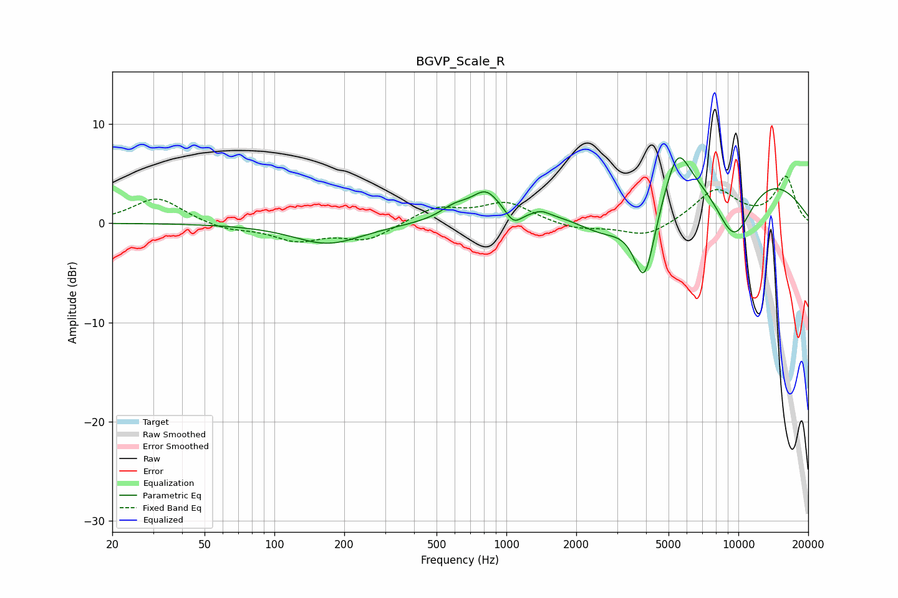

# BGVP_Scale_R
See [usage instructions](https://github.com/jaakkopasanen/AutoEq#usage) for more options and info.

### Parametric EQs
Apply preamp of -6.7 dB when using parametric equalizer.

|   # | Type    |   Fc (Hz) |    Q |   Gain (dB) |
|-----|---------|-----------|------|-------------|
|   1 | Peaking |       170 | 0.96 |        -2.1 |
|   2 | Peaking |       599 | 2.19 |         1.2 |
|   3 | Peaking |       817 | 2.31 |         2.6 |
|   4 | Peaking |      1075 | 4.12 |        -1.4 |
|   5 | Peaking |      1412 | 3.87 |         0.5 |
|   6 | Peaking |      2680 | 1.05 |        -3.9 |
|   7 | Peaking |      3939 | 2.8  |        -8.6 |
|   8 | Peaking |      5468 | 2.7  |         4.3 |
|   9 | Peaking |      7787 | 0.27 |         7   |
|  10 | Peaking |      9555 | 1.35 |        -7.5 |

### Fixed Band EQs
When using fixed band (also called graphic) equalizer, apply preamp of **-4.8 dB** (if available) and set gains manually with these parameters.

|   # | Type    |   Fc (Hz) |    Q |   Gain (dB) |
|-----|---------|-----------|------|-------------|
|   1 | Peaking |        31 | 1.41 |         2.6 |
|   2 | Peaking |        62 | 1.41 |        -0.7 |
|   3 | Peaking |       125 | 1.41 |        -1.6 |
|   4 | Peaking |       250 | 1.41 |        -1.7 |
|   5 | Peaking |       500 | 1.41 |         1.6 |
|   6 | Peaking |      1000 | 1.41 |         2   |
|   7 | Peaking |      2000 | 1.41 |        -0.7 |
|   8 | Peaking |      4000 | 1.41 |        -1.5 |
|   9 | Peaking |      8000 | 1.41 |         3.4 |
|  10 | Peaking |     16000 | 1.41 |         4.6 |

### Graphs

