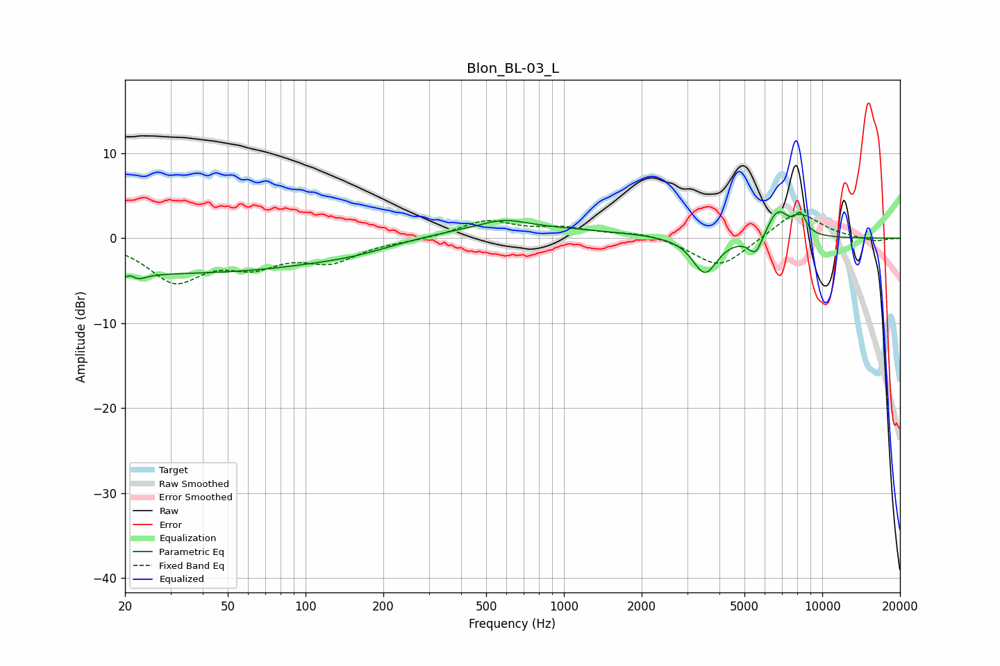

# Blon_BL-03_L
See [usage instructions](https://github.com/jaakkopasanen/AutoEq#usage) for more options and info.

### Parametric EQs
Apply preamp of -3.2 dB when using parametric equalizer.

|   # | Type    |   Fc (Hz) |    Q |   Gain (dB) |
|-----|---------|-----------|------|-------------|
|   1 | Peaking |        21 | 5.95 |         3.2 |
|   2 | Peaking |        21 | 4.58 |        -3.7 |
|   3 | Peaking |        35 | 0.19 |        -4.1 |
|   4 | Peaking |       162 | 0.95 |        -0.6 |
|   5 | Peaking |       455 | 0.29 |         1.5 |
|   6 | Peaking |       583 | 1.59 |         1   |
|   7 | Peaking |      3516 | 2.93 |        -4.3 |
|   8 | Peaking |      5526 | 4.84 |        -2.4 |
|   9 | Peaking |      6730 | 3.04 |         3.4 |
|  10 | Peaking |      8243 | 6    |         2.2 |

### Fixed Band EQs
When using fixed band (also called graphic) equalizer, apply preamp of **-2.9 dB** (if available) and set gains manually with these parameters.

|   # | Type    |   Fc (Hz) |    Q |   Gain (dB) |
|-----|---------|-----------|------|-------------|
|   1 | Peaking |        31 | 1.41 |        -4.8 |
|   2 | Peaking |        62 | 1.41 |        -2.6 |
|   3 | Peaking |       125 | 1.41 |        -2.5 |
|   4 | Peaking |       250 | 1.41 |        -0.2 |
|   5 | Peaking |       500 | 1.41 |         2   |
|   6 | Peaking |      1000 | 1.41 |         1   |
|   7 | Peaking |      2000 | 1.41 |         0.7 |
|   8 | Peaking |      4000 | 1.41 |        -3.6 |
|   9 | Peaking |      8000 | 1.41 |         3.3 |
|  10 | Peaking |     16000 | 1.41 |        -0.4 |

### Graphs

