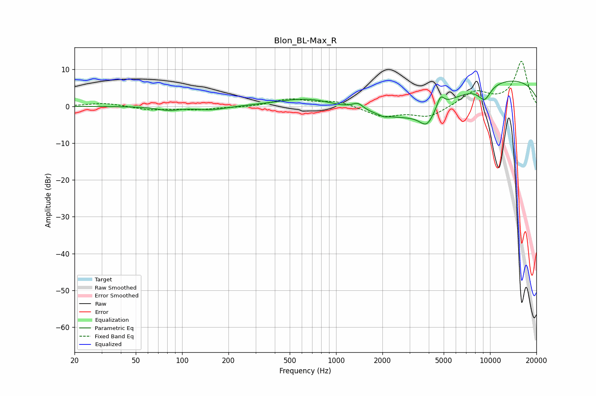

# Blon_BL-Max_R
See [usage instructions](https://github.com/jaakkopasanen/AutoEq#usage) for more options and info.

### Parametric EQs
Apply preamp of -6.9 dB when using parametric equalizer.

|   # | Type    |   Fc (Hz) |    Q |   Gain (dB) |
|-----|---------|-----------|------|-------------|
|   1 | Peaking |        82 | 1.94 |        -1   |
|   2 | Peaking |       155 | 1.43 |        -1   |
|   3 | Peaking |       660 | 0.75 |         2.6 |
|   4 | Peaking |      1385 | 3.82 |         1.8 |
|   5 | Peaking |      2049 | 5.59 |        -0.5 |
|   6 | Peaking |      3042 | 0.48 |        -8.3 |
|   7 | Peaking |      3887 | 2.98 |        -4.2 |
|   8 | Peaking |      4768 | 5.93 |         3.2 |
|   9 | Peaking |      9211 | 3.01 |        -4   |
|  10 | Peaking |      9391 | 0.19 |         8.5 |

### Fixed Band EQs
When using fixed band (also called graphic) equalizer, apply preamp of **-12.3 dB** (if available) and set gains manually with these parameters.

|   # | Type    |   Fc (Hz) |    Q |   Gain (dB) |
|-----|---------|-----------|------|-------------|
|   1 | Peaking |        31 | 1.41 |         0.9 |
|   2 | Peaking |        62 | 1.41 |        -0.9 |
|   3 | Peaking |       125 | 1.41 |        -0.8 |
|   4 | Peaking |       250 | 1.41 |        -0.3 |
|   5 | Peaking |       500 | 1.41 |         1.9 |
|   6 | Peaking |      1000 | 1.41 |         1.4 |
|   7 | Peaking |      2000 | 1.41 |        -2.7 |
|   8 | Peaking |      4000 | 1.41 |        -2.9 |
|   9 | Peaking |      8000 | 1.41 |         3.9 |
|  10 | Peaking |     16000 | 1.41 |        12.1 |

### Graphs

