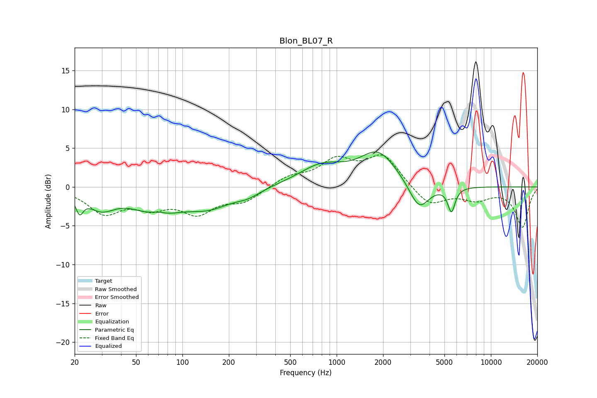

# Blon_BL07_R
See [usage instructions](https://github.com/jaakkopasanen/AutoEq#usage) for more options and info.

### Parametric EQs
Apply preamp of -4.6 dB when using parametric equalizer.

|   # | Type    |   Fc (Hz) |    Q |   Gain (dB) |
|-----|---------|-----------|------|-------------|
|   1 | Peaking |        22 | 5.96 |        -2.1 |
|   2 | Peaking |        30 | 1.58 |        -2.3 |
|   3 | Peaking |        68 | 1.04 |        -3.6 |
|   4 | Peaking |        69 | 2.05 |         1.2 |
|   5 | Peaking |       148 | 0.97 |        -2.2 |
|   6 | Peaking |       265 | 1.73 |        -0.8 |
|   7 | Peaking |       801 | 0.95 |         2.5 |
|   8 | Peaking |      1864 | 1.18 |         4.3 |
|   9 | Peaking |      3425 | 2.17 |        -3.6 |
|  10 | Peaking |      5551 | 5.96 |        -3.1 |

### Fixed Band EQs
When using fixed band (also called graphic) equalizer, apply preamp of **-4.2 dB** (if available) and set gains manually with these parameters.

|   # | Type    |   Fc (Hz) |    Q |   Gain (dB) |
|-----|---------|-----------|------|-------------|
|   1 | Peaking |        31 | 1.41 |        -3.2 |
|   2 | Peaking |        62 | 1.41 |        -2.1 |
|   3 | Peaking |       125 | 1.41 |        -3   |
|   4 | Peaking |       250 | 1.41 |        -1.7 |
|   5 | Peaking |       500 | 1.41 |         1.2 |
|   6 | Peaking |      1000 | 1.41 |         3.2 |
|   7 | Peaking |      2000 | 1.41 |         3.9 |
|   8 | Peaking |      4000 | 1.41 |        -2.5 |
|   9 | Peaking |      8000 | 1.41 |        -1.4 |
|  10 | Peaking |     16000 | 1.41 |        -5.1 |

### Graphs

