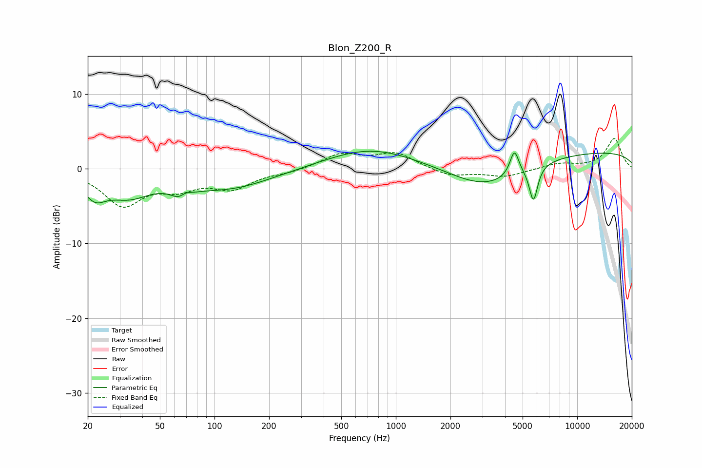

# Blon_Z200_R
See [usage instructions](https://github.com/jaakkopasanen/AutoEq#usage) for more options and info.

### Parametric EQs
Apply preamp of -2.5 dB when using parametric equalizer.

|   # | Type    |   Fc (Hz) |    Q |   Gain (dB) |
|-----|---------|-----------|------|-------------|
|   1 | Peaking |        22 | 2.27 |        -2.7 |
|   2 | Peaking |        34 | 1.14 |        -3   |
|   3 | Peaking |        67 | 2.95 |        -3.2 |
|   4 | Peaking |        68 | 3.74 |         2.4 |
|   5 | Peaking |       119 | 0.58 |        -2.6 |
|   6 | Peaking |       724 | 0.57 |         2.8 |
|   7 | Peaking |      3153 | 0.69 |        -3.9 |
|   8 | Peaking |      4506 | 5.68 |         3.4 |
|   9 | Peaking |      5738 | 6    |        -4.7 |
|  10 | Peaking |     10000 | 0.18 |         2.4 |

### Fixed Band EQs
When using fixed band (also called graphic) equalizer, apply preamp of **-4.1 dB** (if available) and set gains manually with these parameters.

|   # | Type    |   Fc (Hz) |    Q |   Gain (dB) |
|-----|---------|-----------|------|-------------|
|   1 | Peaking |        31 | 1.41 |        -4.7 |
|   2 | Peaking |        62 | 1.41 |        -2.1 |
|   3 | Peaking |       125 | 1.41 |        -2.4 |
|   4 | Peaking |       250 | 1.41 |        -0.4 |
|   5 | Peaking |       500 | 1.41 |         1.9 |
|   6 | Peaking |      1000 | 1.41 |         2   |
|   7 | Peaking |      2000 | 1.41 |        -1   |
|   8 | Peaking |      4000 | 1.41 |        -1   |
|   9 | Peaking |      8000 | 1.41 |         0.7 |
|  10 | Peaking |     16000 | 1.41 |         4   |

### Graphs

