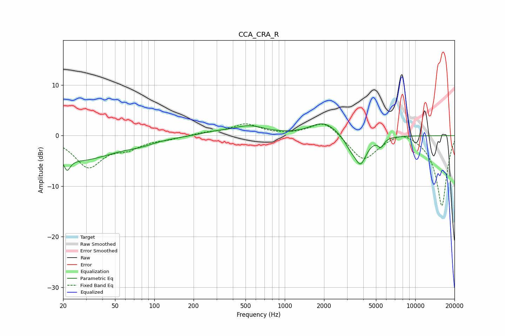

# CCA_CRA_R
See [usage instructions](https://github.com/jaakkopasanen/AutoEq#usage) for more options and info.

### Parametric EQs
Apply preamp of -2.4 dB when using parametric equalizer.

|   # | Type    |   Fc (Hz) |    Q |   Gain (dB) |
|-----|---------|-----------|------|-------------|
|   1 | Peaking |        21 | 5.99 |         2.9 |
|   2 | Peaking |        21 | 5.8  |        -5.3 |
|   3 | Peaking |        27 | 0.55 |        -4.6 |
|   4 | Peaking |        78 | 1.21 |        -0.8 |
|   5 | Peaking |       289 | 1.34 |         0.5 |
|   6 | Peaking |       531 | 1.14 |         1.8 |
|   7 | Peaking |      1983 | 1.39 |         2.6 |
|   8 | Peaking |      3168 | 3.27 |        -1.6 |
|   9 | Peaking |      3805 | 2.96 |        -5.4 |
|  10 | Peaking |      5465 | 6    |        -1.6 |

### Fixed Band EQs
When using fixed band (also called graphic) equalizer, apply preamp of **-2.4 dB** (if available) and set gains manually with these parameters.

|   # | Type    |   Fc (Hz) |    Q |   Gain (dB) |
|-----|---------|-----------|------|-------------|
|   1 | Peaking |        31 | 1.41 |        -6   |
|   2 | Peaking |        62 | 1.41 |        -2   |
|   3 | Peaking |       125 | 1.41 |        -0.5 |
|   4 | Peaking |       250 | 1.41 |         0.5 |
|   5 | Peaking |       500 | 1.41 |         2.2 |
|   6 | Peaking |      1000 | 1.41 |         0   |
|   7 | Peaking |      2000 | 1.41 |         3   |
|   8 | Peaking |      4000 | 1.41 |        -5   |
|   9 | Peaking |      8000 | 1.41 |         1.4 |
|  10 | Peaking |     16000 | 1.41 |       -14   |

### Graphs

