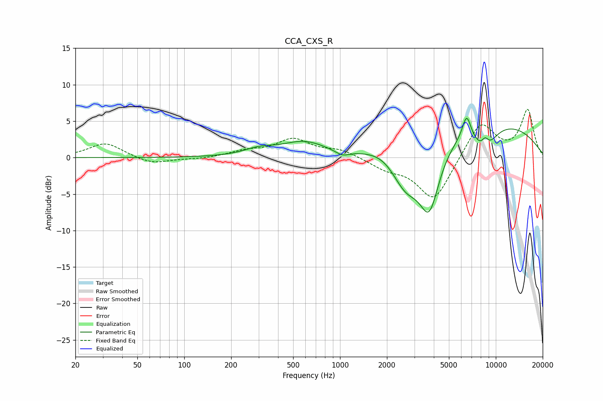

# CCA_CXS_R
See [usage instructions](https://github.com/jaakkopasanen/AutoEq#usage) for more options and info.

### Parametric EQs
Apply preamp of -5.5 dB when using parametric equalizer.

|   # | Type    |   Fc (Hz) |    Q |   Gain (dB) |
|-----|---------|-----------|------|-------------|
|   1 | Peaking |       304 | 1.43 |         0.9 |
|   2 | Peaking |       588 | 0.99 |         2   |
|   3 | Peaking |      1033 | 3.06 |        -0.7 |
|   4 | Peaking |      1895 | 1.34 |         0.9 |
|   5 | Peaking |      2647 | 1.46 |        -5.4 |
|   6 | Peaking |      3745 | 2.07 |        -8.8 |
|   7 | Peaking |      6499 | 4.88 |         3.3 |
|   8 | Peaking |      8358 | 0.28 |         5.2 |
|   9 | Peaking |      8495 | 2    |        -4.1 |
|  10 | Peaking |      8541 | 4.84 |         2   |

### Fixed Band EQs
When using fixed band (also called graphic) equalizer, apply preamp of **-6.7 dB** (if available) and set gains manually with these parameters.

|   # | Type    |   Fc (Hz) |    Q |   Gain (dB) |
|-----|---------|-----------|------|-------------|
|   1 | Peaking |        31 | 1.41 |         2   |
|   2 | Peaking |        62 | 1.41 |        -0.9 |
|   3 | Peaking |       125 | 1.41 |        -0.2 |
|   4 | Peaking |       250 | 1.41 |         0.8 |
|   5 | Peaking |       500 | 1.41 |         2.4 |
|   6 | Peaking |      1000 | 1.41 |         1   |
|   7 | Peaking |      2000 | 1.41 |        -1.3 |
|   8 | Peaking |      4000 | 1.41 |        -6   |
|   9 | Peaking |      8000 | 1.41 |         5   |
|  10 | Peaking |     16000 | 1.41 |         6.4 |

### Graphs

