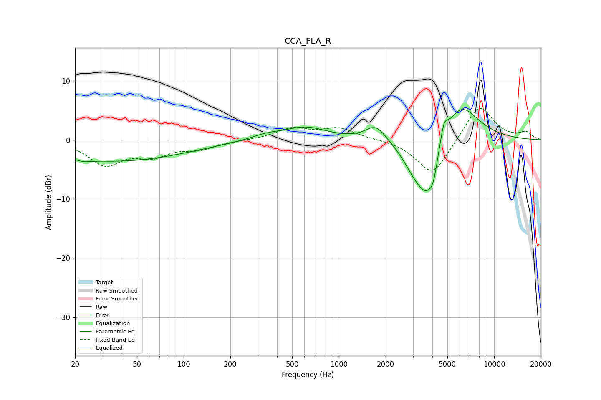

# CCA_FLA_R
See [usage instructions](https://github.com/jaakkopasanen/AutoEq#usage) for more options and info.

### Parametric EQs
Apply preamp of -5.2 dB when using parametric equalizer.

|   # | Type    |   Fc (Hz) |    Q |   Gain (dB) |
|-----|---------|-----------|------|-------------|
|   1 | Peaking |        23 | 3.35 |        -0.4 |
|   2 | Peaking |        36 | 0.3  |        -3.6 |
|   3 | Peaking |       339 | 1.42 |         0.8 |
|   4 | Peaking |       610 | 1.03 |         2.1 |
|   5 | Peaking |      1731 | 2.15 |         2.7 |
|   6 | Peaking |      3047 | 1.86 |        -2.9 |
|   7 | Peaking |      3712 | 1.83 |        -9.1 |
|   8 | Peaking |      4055 | 5.97 |        -2   |
|   9 | Peaking |      4744 | 5.61 |         3.3 |
|  10 | Peaking |      6003 | 1.18 |         7   |

### Fixed Band EQs
When using fixed band (also called graphic) equalizer, apply preamp of **-5.4 dB** (if available) and set gains manually with these parameters.

|   # | Type    |   Fc (Hz) |    Q |   Gain (dB) |
|-----|---------|-----------|------|-------------|
|   1 | Peaking |        31 | 1.41 |        -4   |
|   2 | Peaking |        62 | 1.41 |        -2.4 |
|   3 | Peaking |       125 | 1.41 |        -1.4 |
|   4 | Peaking |       250 | 1.41 |        -0.1 |
|   5 | Peaking |       500 | 1.41 |         1.9 |
|   6 | Peaking |      1000 | 1.41 |         1.9 |
|   7 | Peaking |      2000 | 1.41 |         0.1 |
|   8 | Peaking |      4000 | 1.41 |        -6.1 |
|   9 | Peaking |      8000 | 1.41 |         6.1 |
|  10 | Peaking |     16000 | 1.41 |         1.2 |

### Graphs

