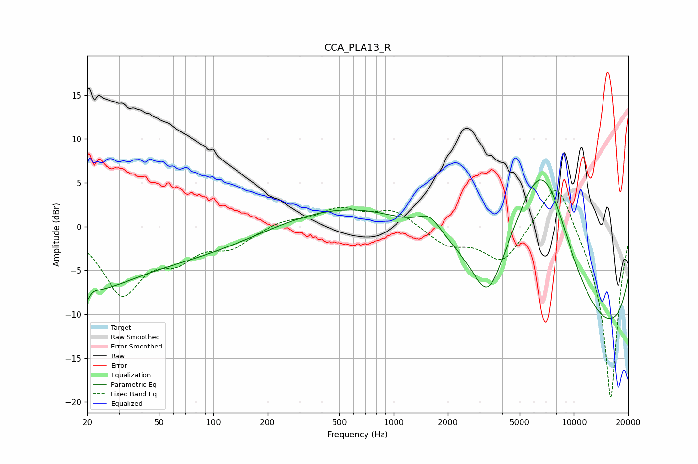

# CCA_PLA13_R
See [usage instructions](https://github.com/jaakkopasanen/AutoEq#usage) for more options and info.

### Parametric EQs
Apply preamp of -5.4 dB when using parametric equalizer.

|   # | Type    |   Fc (Hz) |    Q |   Gain (dB) |
|-----|---------|-----------|------|-------------|
|   1 | Peaking |        20 | 3.9  |        -6.3 |
|   2 | Peaking |        20 | 4.28 |         4.5 |
|   3 | Peaking |        24 | 0.75 |        -2.5 |
|   4 | Peaking |        29 | 0.19 |        -4.2 |
|   5 | Peaking |       861 | 0.31 |         3.5 |
|   6 | Peaking |      1586 | 2.19 |         2.1 |
|   7 | Peaking |      3342 | 1.59 |        -6.9 |
|   8 | Peaking |      6333 | 0.61 |        15.8 |
|   9 | Peaking |      7203 | 0.99 |         5.9 |
|  10 | Peaking |     10000 | 0.18 |       -16.6 |

### Fixed Band EQs
When using fixed band (also called graphic) equalizer, apply preamp of **-4.2 dB** (if available) and set gains manually with these parameters.

|   # | Type    |   Fc (Hz) |    Q |   Gain (dB) |
|-----|---------|-----------|------|-------------|
|   1 | Peaking |        31 | 1.41 |        -7.4 |
|   2 | Peaking |        62 | 1.41 |        -2.9 |
|   3 | Peaking |       125 | 1.41 |        -2.1 |
|   4 | Peaking |       250 | 1.41 |         0.8 |
|   5 | Peaking |       500 | 1.41 |         1.9 |
|   6 | Peaking |      1000 | 1.41 |         1.9 |
|   7 | Peaking |      2000 | 1.41 |        -2   |
|   8 | Peaking |      4000 | 1.41 |        -4   |
|   9 | Peaking |      8000 | 1.41 |         6.5 |
|  10 | Peaking |     16000 | 1.41 |       -20   |

### Graphs

