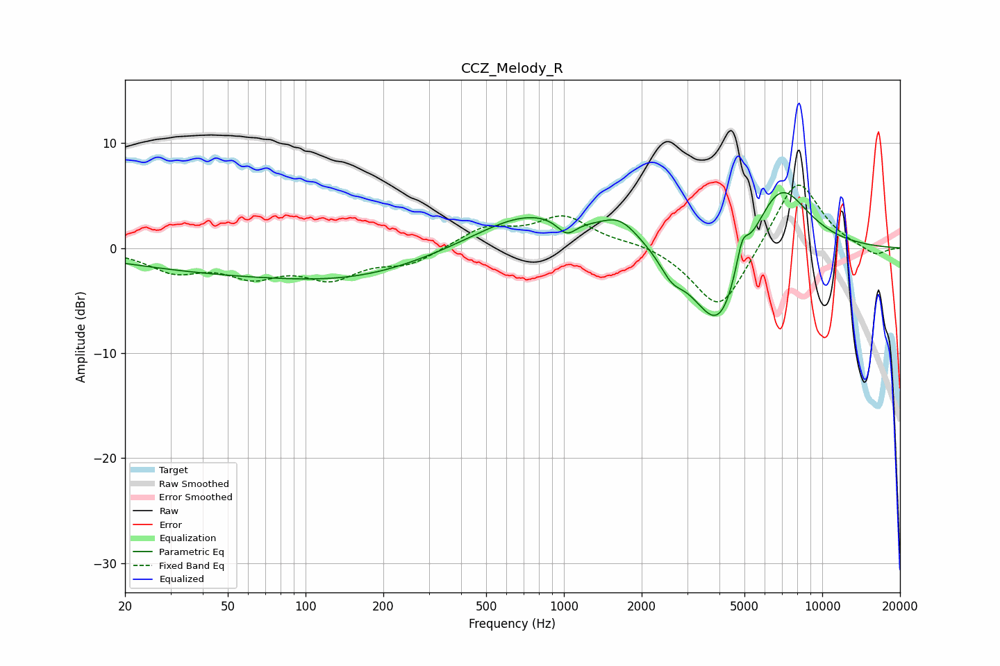

# CCZ_Melody_R
See [usage instructions](https://github.com/jaakkopasanen/AutoEq#usage) for more options and info.

### Parametric EQs
Apply preamp of -5.4 dB when using parametric equalizer.

|   # | Type    |   Fc (Hz) |    Q |   Gain (dB) |
|-----|---------|-----------|------|-------------|
|   1 | Peaking |        76 | 0.24 |        -2.5 |
|   2 | Peaking |       160 | 0.56 |        -0.8 |
|   3 | Peaking |       745 | 0.66 |         3.5 |
|   4 | Peaking |      1025 | 3.79 |        -1.5 |
|   5 | Peaking |      1647 | 1.89 |         2   |
|   6 | Peaking |      2613 | 3.07 |        -1.8 |
|   7 | Peaking |      3518 | 1.45 |        -2.3 |
|   8 | Peaking |      4058 | 1.65 |        -6.8 |
|   9 | Peaking |      4898 | 6    |         2.7 |
|  10 | Peaking |      6832 | 1.22 |         6.8 |

### Fixed Band EQs
When using fixed band (also called graphic) equalizer, apply preamp of **-6.1 dB** (if available) and set gains manually with these parameters.

|   # | Type    |   Fc (Hz) |    Q |   Gain (dB) |
|-----|---------|-----------|------|-------------|
|   1 | Peaking |        31 | 1.41 |        -2   |
|   2 | Peaking |        62 | 1.41 |        -2.3 |
|   3 | Peaking |       125 | 1.41 |        -2.6 |
|   4 | Peaking |       250 | 1.41 |        -1.4 |
|   5 | Peaking |       500 | 1.41 |         1.9 |
|   6 | Peaking |      1000 | 1.41 |         2.9 |
|   7 | Peaking |      2000 | 1.41 |         0.5 |
|   8 | Peaking |      4000 | 1.41 |        -6.3 |
|   9 | Peaking |      8000 | 1.41 |         6.9 |
|  10 | Peaking |     16000 | 1.41 |        -0.8 |

### Graphs

