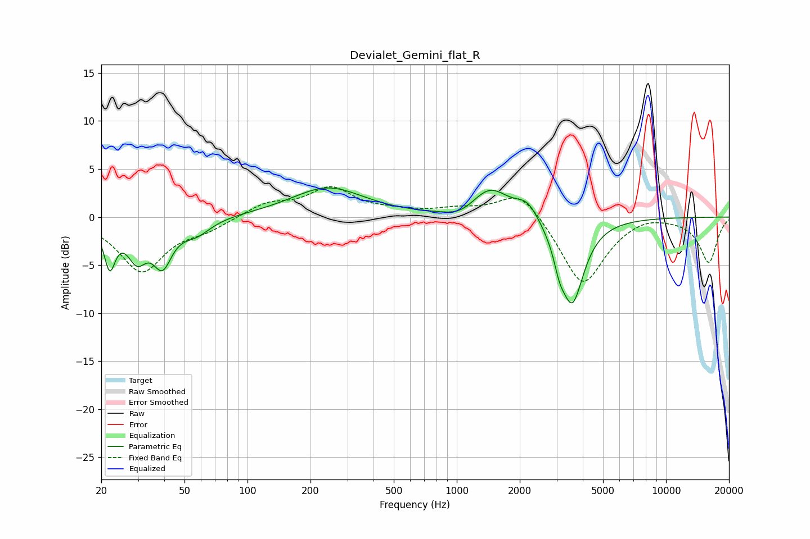

# Devialet_Gemini_flat_R
See [usage instructions](https://github.com/jaakkopasanen/AutoEq#usage) for more options and info.

### Parametric EQs
Apply preamp of -3.1 dB when using parametric equalizer.

|   # | Type    |   Fc (Hz) |    Q |   Gain (dB) |
|-----|---------|-----------|------|-------------|
|   1 | Peaking |        22 | 5.33 |        -4.5 |
|   2 | Peaking |        30 | 3.07 |        -3.6 |
|   3 | Peaking |        39 | 3.14 |        -4.2 |
|   4 | Peaking |        57 | 2    |        -1.5 |
|   5 | Peaking |       242 | 0.82 |         3   |
|   6 | Peaking |      1048 | 1.83 |        -0.9 |
|   7 | Peaking |      1439 | 1.57 |         3.1 |
|   8 | Peaking |      2174 | 2.66 |         1.7 |
|   9 | Peaking |      3094 | 5.57 |        -1.8 |
|  10 | Peaking |      3559 | 2.49 |        -8.9 |

### Fixed Band EQs
When using fixed band (also called graphic) equalizer, apply preamp of **-3.3 dB** (if available) and set gains manually with these parameters.

|   # | Type    |   Fc (Hz) |    Q |   Gain (dB) |
|-----|---------|-----------|------|-------------|
|   1 | Peaking |        31 | 1.41 |        -5.6 |
|   2 | Peaking |        62 | 1.41 |        -1.1 |
|   3 | Peaking |       125 | 1.41 |         1.4 |
|   4 | Peaking |       250 | 1.41 |         2.9 |
|   5 | Peaking |       500 | 1.41 |         0.4 |
|   6 | Peaking |      1000 | 1.41 |         0.7 |
|   7 | Peaking |      2000 | 1.41 |         3   |
|   8 | Peaking |      4000 | 1.41 |        -7.3 |
|   9 | Peaking |      8000 | 1.41 |         0.5 |
|  10 | Peaking |     16000 | 1.41 |        -4.7 |

### Graphs

