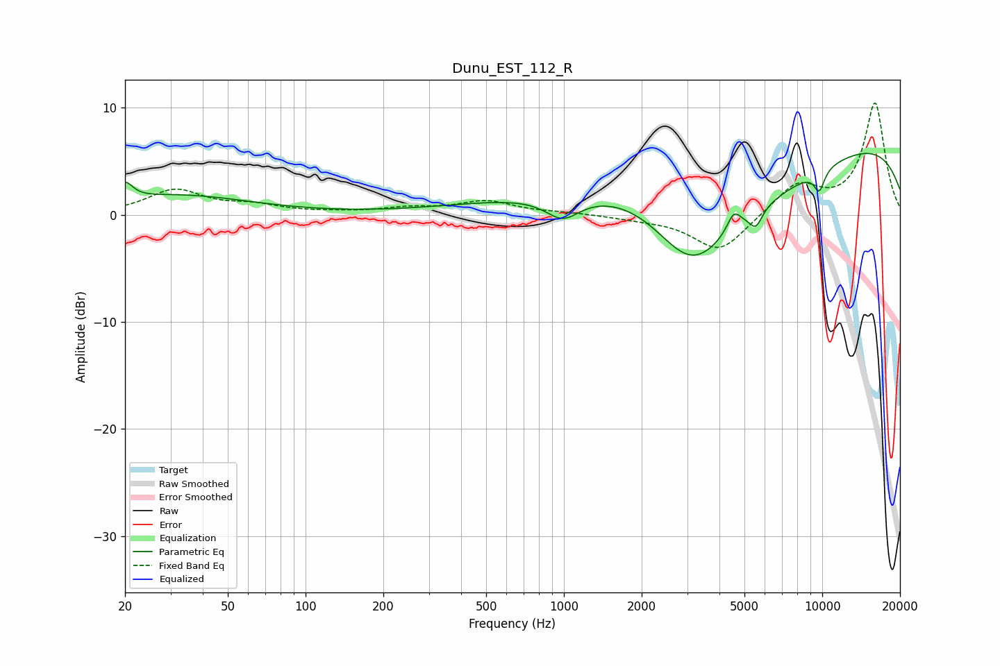

# Dunu_EST_112_R
See [usage instructions](https://github.com/jaakkopasanen/AutoEq#usage) for more options and info.

### Parametric EQs
Apply preamp of -5.8 dB when using parametric equalizer.

|   # | Type    |   Fc (Hz) |    Q |   Gain (dB) |
|-----|---------|-----------|------|-------------|
|   1 | Peaking |        20 | 4.89 |         1.6 |
|   2 | Peaking |        32 | 0.51 |         1.8 |
|   3 | Peaking |       990 | 2.14 |        -2.1 |
|   4 | Peaking |      1479 | 0.3  |         3.2 |
|   5 | Peaking |      2244 | 0.49 |         5.9 |
|   6 | Peaking |      3111 | 0.51 |       -17.3 |
|   7 | Peaking |      4549 | 5.32 |         1.7 |
|   8 | Peaking |      5534 | 5.53 |        -1.6 |
|   9 | Peaking |      9450 | 0.18 |         7.8 |
|  10 | Peaking |      9741 | 5.96 |        -1.9 |

### Fixed Band EQs
When using fixed band (also called graphic) equalizer, apply preamp of **-10.5 dB** (if available) and set gains manually with these parameters.

|   # | Type    |   Fc (Hz) |    Q |   Gain (dB) |
|-----|---------|-----------|------|-------------|
|   1 | Peaking |        31 | 1.41 |         2.3 |
|   2 | Peaking |        62 | 1.41 |         0.7 |
|   3 | Peaking |       125 | 1.41 |         0.1 |
|   4 | Peaking |       250 | 1.41 |         0.5 |
|   5 | Peaking |       500 | 1.41 |         1.2 |
|   6 | Peaking |      1000 | 1.41 |         0.2 |
|   7 | Peaking |      2000 | 1.41 |        -0.3 |
|   8 | Peaking |      4000 | 1.41 |        -3.5 |
|   9 | Peaking |      8000 | 1.41 |         2.8 |
|  10 | Peaking |     16000 | 1.41 |        10.4 |

### Graphs

