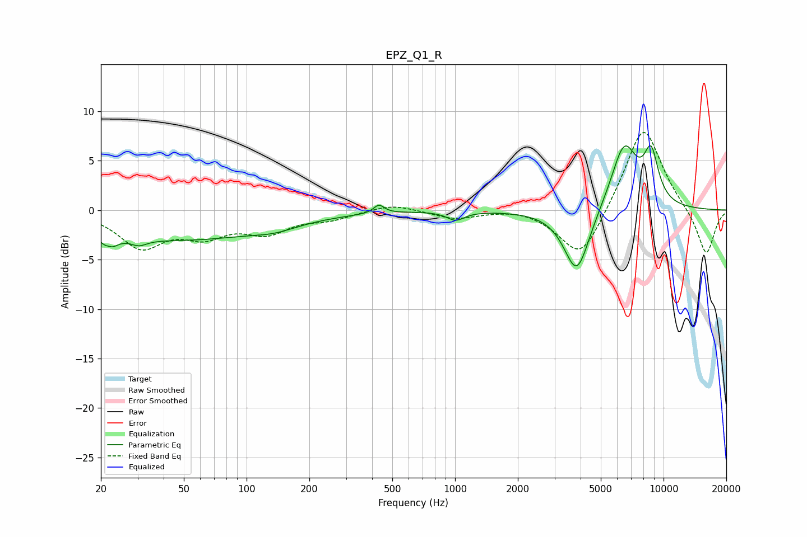

# EPZ_Q1_R
See [usage instructions](https://github.com/jaakkopasanen/AutoEq#usage) for more options and info.

### Parametric EQs
Apply preamp of -6.6 dB when using parametric equalizer.

|   # | Type    |   Fc (Hz) |    Q |   Gain (dB) |
|-----|---------|-----------|------|-------------|
|   1 | Peaking |        22 | 4.7  |        -3.3 |
|   2 | Peaking |        22 | 5.99 |         2.1 |
|   3 | Peaking |        30 | 3.61 |        -0.7 |
|   4 | Peaking |        46 | 0.32 |        -2.9 |
|   5 | Peaking |       137 | 1.34 |        -0.6 |
|   6 | Peaking |       431 | 5.59 |         0.9 |
|   7 | Peaking |      1007 | 3.36 |        -0.9 |
|   8 | Peaking |      3838 | 2.25 |        -6.6 |
|   9 | Peaking |      6473 | 2.1  |         6.7 |
|  10 | Peaking |      8721 | 3.68 |         4.8 |

### Fixed Band EQs
When using fixed band (also called graphic) equalizer, apply preamp of **-7.9 dB** (if available) and set gains manually with these parameters.

|   # | Type    |   Fc (Hz) |    Q |   Gain (dB) |
|-----|---------|-----------|------|-------------|
|   1 | Peaking |        31 | 1.41 |        -3.6 |
|   2 | Peaking |        62 | 1.41 |        -2.2 |
|   3 | Peaking |       125 | 1.41 |        -2   |
|   4 | Peaking |       250 | 1.41 |        -0.8 |
|   5 | Peaking |       500 | 1.41 |         0.7 |
|   6 | Peaking |      1000 | 1.41 |        -0.8 |
|   7 | Peaking |      2000 | 1.41 |         0.3 |
|   8 | Peaking |      4000 | 1.41 |        -5.2 |
|   9 | Peaking |      8000 | 1.41 |         8.9 |
|  10 | Peaking |     16000 | 1.41 |        -4.7 |

### Graphs

