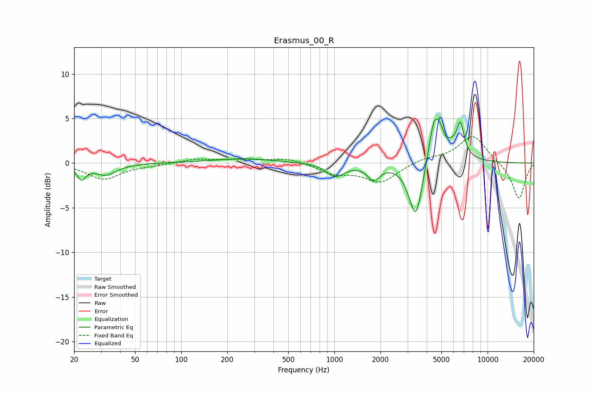

# Erasmus_00_R
See [usage instructions](https://github.com/jaakkopasanen/AutoEq#usage) for more options and info.

### Parametric EQs
Apply preamp of -5.1 dB when using parametric equalizer.

|   # | Type    |   Fc (Hz) |    Q |   Gain (dB) |
|-----|---------|-----------|------|-------------|
|   1 | Peaking |        22 | 4.89 |        -1.5 |
|   2 | Peaking |        32 | 2.03 |        -1.3 |
|   3 | Peaking |       256 | 0.65 |         0.5 |
|   4 | Peaking |      1017 | 2.47 |        -1.5 |
|   5 | Peaking |      1804 | 3.38 |        -1.6 |
|   6 | Peaking |      3413 | 2.98 |        -7.1 |
|   7 | Peaking |      4459 | 5.31 |         1.8 |
|   8 | Peaking |      4799 | 2.05 |         5.4 |
|   9 | Peaking |      5316 | 5.49 |        -1.2 |
|  10 | Peaking |      6644 | 5.69 |         3.4 |

### Fixed Band EQs
When using fixed band (also called graphic) equalizer, apply preamp of **-3.1 dB** (if available) and set gains manually with these parameters.

|   # | Type    |   Fc (Hz) |    Q |   Gain (dB) |
|-----|---------|-----------|------|-------------|
|   1 | Peaking |        31 | 1.41 |        -1.8 |
|   2 | Peaking |        62 | 1.41 |        -0.2 |
|   3 | Peaking |       125 | 1.41 |         0.4 |
|   4 | Peaking |       250 | 1.41 |         0.4 |
|   5 | Peaking |       500 | 1.41 |         0.6 |
|   6 | Peaking |      1000 | 1.41 |        -1.1 |
|   7 | Peaking |      2000 | 1.41 |        -2.1 |
|   8 | Peaking |      4000 | 1.41 |         0.5 |
|   9 | Peaking |      8000 | 1.41 |         3.2 |
|  10 | Peaking |     16000 | 1.41 |        -4.1 |

### Graphs

