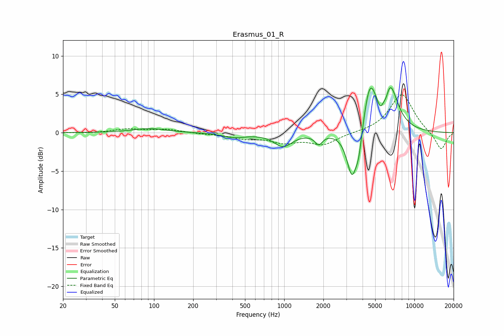

# Erasmus_01_R
See [usage instructions](https://github.com/jaakkopasanen/AutoEq#usage) for more options and info.

### Parametric EQs
Apply preamp of -5.9 dB when using parametric equalizer.

|   # | Type    |   Fc (Hz) |    Q |   Gain (dB) |
|-----|---------|-----------|------|-------------|
|   1 | Peaking |        92 | 1.13 |         0.5 |
|   2 | Peaking |       413 | 1.58 |        -0.6 |
|   3 | Peaking |       981 | 2.04 |        -1.7 |
|   4 | Peaking |      1839 | 4.89 |        -1.3 |
|   5 | Peaking |      3324 | 3.42 |        -6.3 |
|   6 | Peaking |      3742 | 6    |        -2.4 |
|   7 | Peaking |      4548 | 2.98 |         5.7 |
|   8 | Peaking |      5495 | 5.93 |        -1.7 |
|   9 | Peaking |      6057 | 5.78 |        -1.7 |
|  10 | Peaking |      6394 | 2.23 |         6.5 |

### Fixed Band EQs
When using fixed band (also called graphic) equalizer, apply preamp of **-5.0 dB** (if available) and set gains manually with these parameters.

|   # | Type    |   Fc (Hz) |    Q |   Gain (dB) |
|-----|---------|-----------|------|-------------|
|   1 | Peaking |        31 | 1.41 |        -0.1 |
|   2 | Peaking |        62 | 1.41 |         0.5 |
|   3 | Peaking |       125 | 1.41 |         0.4 |
|   4 | Peaking |       250 | 1.41 |        -0.1 |
|   5 | Peaking |       500 | 1.41 |        -0.7 |
|   6 | Peaking |      1000 | 1.41 |        -1.1 |
|   7 | Peaking |      2000 | 1.41 |        -1.5 |
|   8 | Peaking |      4000 | 1.41 |         0   |
|   9 | Peaking |      8000 | 1.41 |         5.1 |
|  10 | Peaking |     16000 | 1.41 |        -2.3 |

### Graphs

