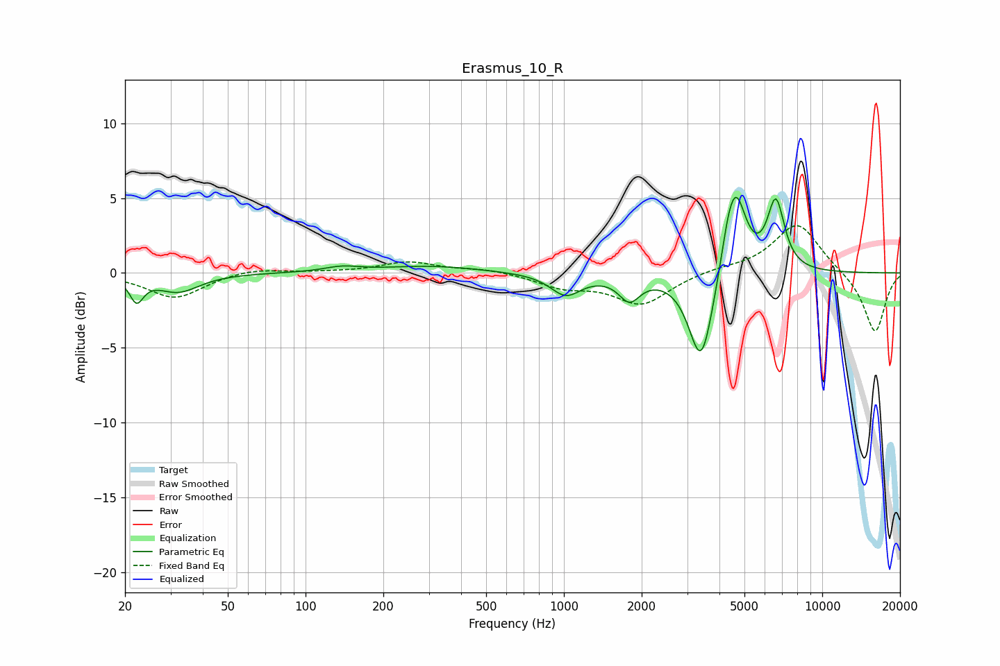

# Erasmus_10_R
See [usage instructions](https://github.com/jaakkopasanen/AutoEq#usage) for more options and info.

### Parametric EQs
Apply preamp of -5.2 dB when using parametric equalizer.

|   # | Type    |   Fc (Hz) |    Q |   Gain (dB) |
|-----|---------|-----------|------|-------------|
|   1 | Peaking |        22 | 5.41 |        -1.6 |
|   2 | Peaking |        32 | 1.75 |        -1.2 |
|   3 | Peaking |       138 | 2.12 |         0.3 |
|   4 | Peaking |       305 | 0.75 |         0.5 |
|   5 | Peaking |      1017 | 2.39 |        -1.4 |
|   6 | Peaking |      1794 | 3.45 |        -1.6 |
|   7 | Peaking |      3401 | 2.95 |        -6.3 |
|   8 | Peaking |      4304 | 5.13 |         1.3 |
|   9 | Peaking |      4633 | 3.41 |         5.2 |
|  10 | Peaking |      6614 | 4.1  |         4.6 |

### Fixed Band EQs
When using fixed band (also called graphic) equalizer, apply preamp of **-3.3 dB** (if available) and set gains manually with these parameters.

|   # | Type    |   Fc (Hz) |    Q |   Gain (dB) |
|-----|---------|-----------|------|-------------|
|   1 | Peaking |        31 | 1.41 |        -1.7 |
|   2 | Peaking |        62 | 1.41 |         0.4 |
|   3 | Peaking |       125 | 1.41 |         0   |
|   4 | Peaking |       250 | 1.41 |         0.7 |
|   5 | Peaking |       500 | 1.41 |         0.3 |
|   6 | Peaking |      1000 | 1.41 |        -0.9 |
|   7 | Peaking |      2000 | 1.41 |        -2.1 |
|   8 | Peaking |      4000 | 1.41 |         0.3 |
|   9 | Peaking |      8000 | 1.41 |         3.4 |
|  10 | Peaking |     16000 | 1.41 |        -4   |

### Graphs

