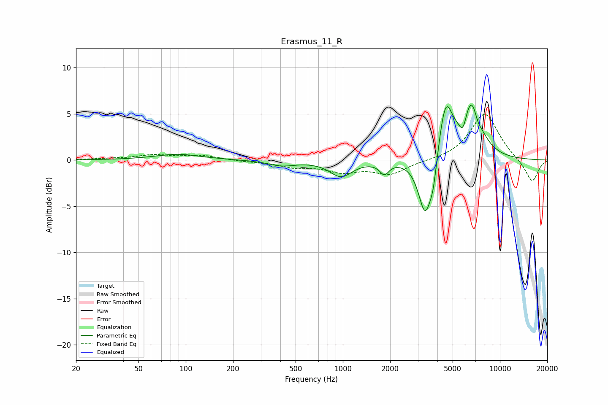

# Erasmus_11_R
See [usage instructions](https://github.com/jaakkopasanen/AutoEq#usage) for more options and info.

### Parametric EQs
Apply preamp of -6.0 dB when using parametric equalizer.

|   # | Type    |   Fc (Hz) |    Q |   Gain (dB) |
|-----|---------|-----------|------|-------------|
|   1 | Peaking |        89 | 0.98 |         0.6 |
|   2 | Peaking |       407 | 1.64 |        -0.6 |
|   3 | Peaking |       973 | 2    |        -1.7 |
|   4 | Peaking |      1835 | 4.82 |        -1.2 |
|   5 | Peaking |      3347 | 3.22 |        -6.5 |
|   6 | Peaking |      3767 | 6    |        -2.3 |
|   7 | Peaking |      4508 | 3.05 |         6.1 |
|   8 | Peaking |      5824 | 5.89 |        -1.8 |
|   9 | Peaking |      6588 | 2.24 |         6.3 |
|  10 | Peaking |      7221 | 6    |        -0.9 |

### Fixed Band EQs
When using fixed band (also called graphic) equalizer, apply preamp of **-5.0 dB** (if available) and set gains manually with these parameters.

|   # | Type    |   Fc (Hz) |    Q |   Gain (dB) |
|-----|---------|-----------|------|-------------|
|   1 | Peaking |        31 | 1.41 |         0.1 |
|   2 | Peaking |        62 | 1.41 |         0.5 |
|   3 | Peaking |       125 | 1.41 |         0.5 |
|   4 | Peaking |       250 | 1.41 |        -0.1 |
|   5 | Peaking |       500 | 1.41 |        -0.7 |
|   6 | Peaking |      1000 | 1.41 |        -1.1 |
|   7 | Peaking |      2000 | 1.41 |        -1.5 |
|   8 | Peaking |      4000 | 1.41 |        -0.1 |
|   9 | Peaking |      8000 | 1.41 |         5.1 |
|  10 | Peaking |     16000 | 1.41 |        -2.5 |

### Graphs

