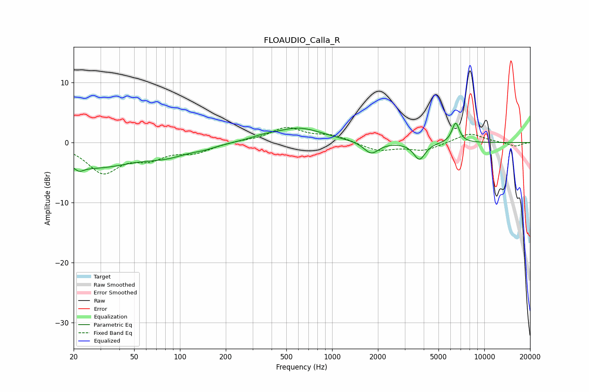

# FLOAUDIO_Calla_R
See [usage instructions](https://github.com/jaakkopasanen/AutoEq#usage) for more options and info.

### Parametric EQs
Apply preamp of -3.3 dB when using parametric equalizer.

|   # | Type    |   Fc (Hz) |    Q |   Gain (dB) |
|-----|---------|-----------|------|-------------|
|   1 | Peaking |        22 | 5.68 |        -4.1 |
|   2 | Peaking |        22 | 5.88 |         3.3 |
|   3 | Peaking |        27 | 0.49 |        -4   |
|   4 | Peaking |        83 | 1.04 |        -1.3 |
|   5 | Peaking |       145 | 1.84 |        -0.5 |
|   6 | Peaking |       349 | 1.8  |         0.4 |
|   7 | Peaking |       604 | 0.89 |         2.4 |
|   8 | Peaking |      1808 | 2.9  |        -2   |
|   9 | Peaking |      3750 | 3.74 |        -2.8 |
|  10 | Peaking |      6484 | 5.53 |         3.3 |

### Fixed Band EQs
When using fixed band (also called graphic) equalizer, apply preamp of **-2.6 dB** (if available) and set gains manually with these parameters.

|   # | Type    |   Fc (Hz) |    Q |   Gain (dB) |
|-----|---------|-----------|------|-------------|
|   1 | Peaking |        31 | 1.41 |        -4.8 |
|   2 | Peaking |        62 | 1.41 |        -2.2 |
|   3 | Peaking |       125 | 1.41 |        -1.5 |
|   4 | Peaking |       250 | 1.41 |         0.2 |
|   5 | Peaking |       500 | 1.41 |         2.4 |
|   6 | Peaking |      1000 | 1.41 |         1.1 |
|   7 | Peaking |      2000 | 1.41 |        -1.4 |
|   8 | Peaking |      4000 | 1.41 |        -1.3 |
|   9 | Peaking |      8000 | 1.41 |         1.6 |
|  10 | Peaking |     16000 | 1.41 |        -0.6 |

### Graphs

