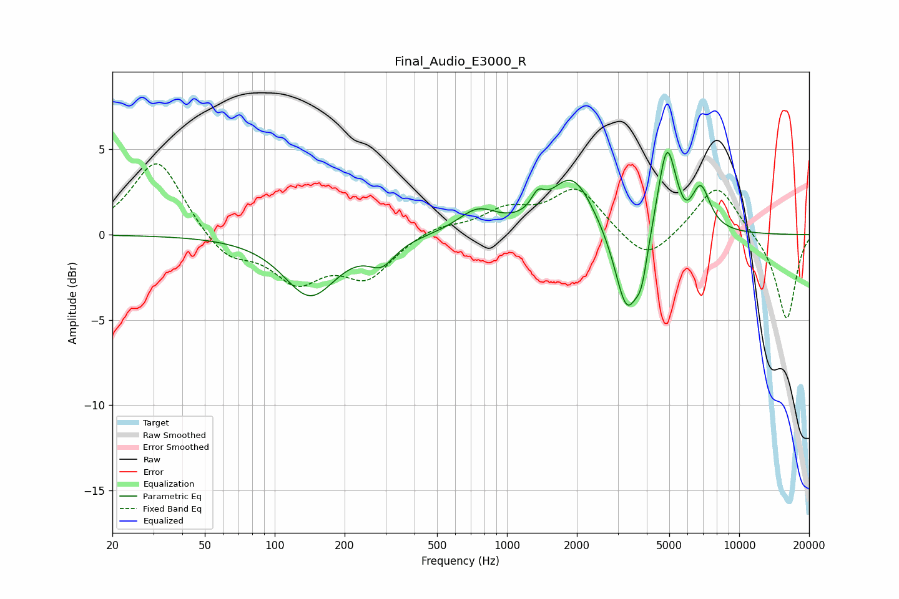

# Final_Audio_E3000_R
See [usage instructions](https://github.com/jaakkopasanen/AutoEq#usage) for more options and info.

### Parametric EQs
Apply preamp of -4.9 dB when using parametric equalizer.

|   # | Type    |   Fc (Hz) |    Q |   Gain (dB) |
|-----|---------|-----------|------|-------------|
|   1 | Peaking |       142 | 1.25 |        -3.5 |
|   2 | Peaking |       289 | 2.48 |        -1.3 |
|   3 | Peaking |       747 | 1.67 |         1.3 |
|   4 | Peaking |      1357 | 5.07 |         1   |
|   5 | Peaking |      1912 | 1.5  |         3.4 |
|   6 | Peaking |      3287 | 2.66 |        -5.1 |
|   7 | Peaking |      3804 | 5.48 |        -1.8 |
|   8 | Peaking |      4882 | 3.52 |         5.3 |
|   9 | Peaking |      5904 | 4.41 |        -0.5 |
|  10 | Peaking |      6829 | 3.33 |         2.5 |

### Fixed Band EQs
When using fixed band (also called graphic) equalizer, apply preamp of **-4.3 dB** (if available) and set gains manually with these parameters.

|   # | Type    |   Fc (Hz) |    Q |   Gain (dB) |
|-----|---------|-----------|------|-------------|
|   1 | Peaking |        31 | 1.41 |         4.5 |
|   2 | Peaking |        62 | 1.41 |        -1.5 |
|   3 | Peaking |       125 | 1.41 |        -2.5 |
|   4 | Peaking |       250 | 1.41 |        -2.4 |
|   5 | Peaking |       500 | 1.41 |         0.6 |
|   6 | Peaking |      1000 | 1.41 |         1.3 |
|   7 | Peaking |      2000 | 1.41 |         2.7 |
|   8 | Peaking |      4000 | 1.41 |        -1.8 |
|   9 | Peaking |      8000 | 1.41 |         3   |
|  10 | Peaking |     16000 | 1.41 |        -5.1 |

### Graphs

