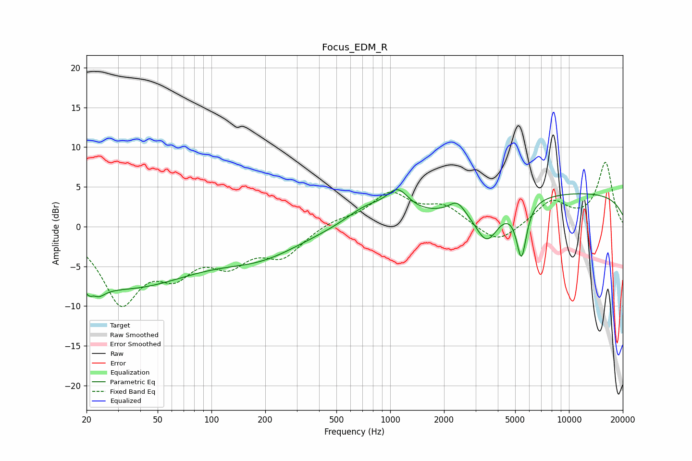

# Focus_EDM_R
See [usage instructions](https://github.com/jaakkopasanen/AutoEq#usage) for more options and info.

### Parametric EQs
Apply preamp of -4.7 dB when using parametric equalizer.

|   # | Type    |   Fc (Hz) |    Q |   Gain (dB) |
|-----|---------|-----------|------|-------------|
|   1 | Peaking |        22 | 3.89 |        -5.4 |
|   2 | Peaking |        22 | 5.36 |         3.6 |
|   3 | Peaking |        33 | 0.35 |        -7.4 |
|   4 | Peaking |       192 | 0.62 |        -2.9 |
|   5 | Peaking |       739 | 1.18 |         2.2 |
|   6 | Peaking |      1102 | 2.27 |         3   |
|   7 | Peaking |      2367 | 3.28 |         1.5 |
|   8 | Peaking |      3468 | 2.12 |        -4.8 |
|   9 | Peaking |      5422 | 4.93 |        -6.9 |
|  10 | Peaking |     10000 | 0.18 |         4.3 |

### Fixed Band EQs
When using fixed band (also called graphic) equalizer, apply preamp of **-8.2 dB** (if available) and set gains manually with these parameters.

|   # | Type    |   Fc (Hz) |    Q |   Gain (dB) |
|-----|---------|-----------|------|-------------|
|   1 | Peaking |        31 | 1.41 |        -9   |
|   2 | Peaking |        62 | 1.41 |        -4.5 |
|   3 | Peaking |       125 | 1.41 |        -3.8 |
|   4 | Peaking |       250 | 1.41 |        -3.4 |
|   5 | Peaking |       500 | 1.41 |         0.8 |
|   6 | Peaking |      1000 | 1.41 |         4   |
|   7 | Peaking |      2000 | 1.41 |         2.3 |
|   8 | Peaking |      4000 | 1.41 |        -2.4 |
|   9 | Peaking |      8000 | 1.41 |         3.1 |
|  10 | Peaking |     16000 | 1.41 |         8   |

### Graphs

