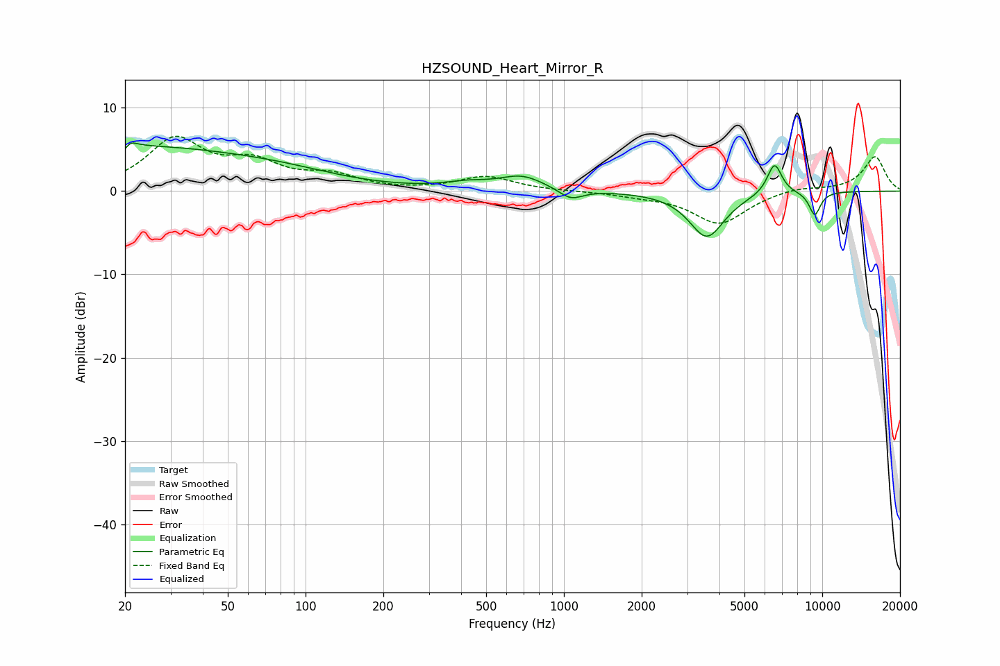

# HZSOUND_Heart_Mirror_R
See [usage instructions](https://github.com/jaakkopasanen/AutoEq#usage) for more options and info.

### Parametric EQs
Apply preamp of -5.9 dB when using parametric equalizer.

|   # | Type    |   Fc (Hz) |    Q |   Gain (dB) |
|-----|---------|-----------|------|-------------|
|   1 | Peaking |        20 | 0.29 |         5.2 |
|   2 | Peaking |        20 | 5.91 |        -3.7 |
|   3 | Peaking |        20 | 5.49 |         3.5 |
|   4 | Peaking |        83 | 0.62 |         1.1 |
|   5 | Peaking |       421 | 1.59 |         0.7 |
|   6 | Peaking |       688 | 1.65 |         1.7 |
|   7 | Peaking |      1064 | 3.13 |        -1.3 |
|   8 | Peaking |      3575 | 2.06 |        -5.5 |
|   9 | Peaking |      6535 | 4.77 |         3.8 |
|  10 | Peaking |      9356 | 5.56 |        -2.8 |

### Fixed Band EQs
When using fixed band (also called graphic) equalizer, apply preamp of **-6.7 dB** (if available) and set gains manually with these parameters.

|   # | Type    |   Fc (Hz) |    Q |   Gain (dB) |
|-----|---------|-----------|------|-------------|
|   1 | Peaking |        31 | 1.41 |         6   |
|   2 | Peaking |        62 | 1.41 |         2.9 |
|   3 | Peaking |       125 | 1.41 |         1.6 |
|   4 | Peaking |       250 | 1.41 |        -0   |
|   5 | Peaking |       500 | 1.41 |         1.7 |
|   6 | Peaking |      1000 | 1.41 |        -0   |
|   7 | Peaking |      2000 | 1.41 |        -0.4 |
|   8 | Peaking |      4000 | 1.41 |        -3.9 |
|   9 | Peaking |      8000 | 1.41 |         0.5 |
|  10 | Peaking |     16000 | 1.41 |         4.2 |

### Graphs

