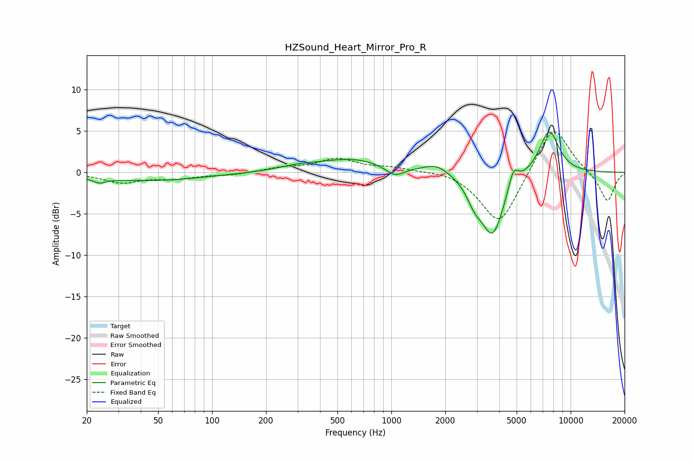

# HZSound_Heart_Mirror_Pro_R
See [usage instructions](https://github.com/jaakkopasanen/AutoEq#usage) for more options and info.

### Parametric EQs
Apply preamp of -5.0 dB when using parametric equalizer.

|   # | Type    |   Fc (Hz) |    Q |   Gain (dB) |
|-----|---------|-----------|------|-------------|
|   1 | Peaking |        23 | 3.68 |        -0.6 |
|   2 | Peaking |        45 | 0.47 |        -1   |
|   3 | Peaking |       300 | 1.26 |         0.5 |
|   4 | Peaking |       607 | 0.77 |         1.6 |
|   5 | Peaking |      1045 | 2.78 |        -1.2 |
|   6 | Peaking |      1791 | 1.89 |         1.1 |
|   7 | Peaking |      2911 | 3.31 |        -1.9 |
|   8 | Peaking |      3675 | 2.15 |        -7.5 |
|   9 | Peaking |      4794 | 5.01 |         2.4 |
|  10 | Peaking |      7587 | 2.39 |         5.3 |

### Fixed Band EQs
When using fixed band (also called graphic) equalizer, apply preamp of **-5.0 dB** (if available) and set gains manually with these parameters.

|   # | Type    |   Fc (Hz) |    Q |   Gain (dB) |
|-----|---------|-----------|------|-------------|
|   1 | Peaking |        31 | 1.41 |        -1.2 |
|   2 | Peaking |        62 | 1.41 |        -0.6 |
|   3 | Peaking |       125 | 1.41 |        -0.3 |
|   4 | Peaking |       250 | 1.41 |         0.5 |
|   5 | Peaking |       500 | 1.41 |         1.6 |
|   6 | Peaking |      1000 | 1.41 |         0.5 |
|   7 | Peaking |      2000 | 1.41 |         0.4 |
|   8 | Peaking |      4000 | 1.41 |        -6.5 |
|   9 | Peaking |      8000 | 1.41 |         6   |
|  10 | Peaking |     16000 | 1.41 |        -3.6 |

### Graphs

