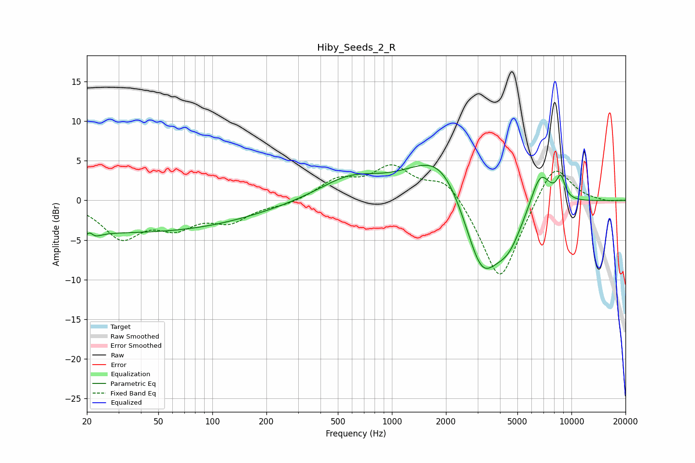

# Hiby_Seeds_2_R
See [usage instructions](https://github.com/jaakkopasanen/AutoEq#usage) for more options and info.

### Parametric EQs
Apply preamp of -4.5 dB when using parametric equalizer.

|   # | Type    |   Fc (Hz) |    Q |   Gain (dB) |
|-----|---------|-----------|------|-------------|
|   1 | Peaking |        21 | 4.51 |        -3.4 |
|   2 | Peaking |        21 | 5.89 |         3.2 |
|   3 | Peaking |        33 | 0.18 |        -4   |
|   4 | Peaking |       583 | 0.81 |         2.7 |
|   5 | Peaking |      1771 | 0.75 |         4.8 |
|   6 | Peaking |      1977 | 1.16 |         2.4 |
|   7 | Peaking |      3161 | 1.27 |       -11   |
|   8 | Peaking |      4473 | 1.81 |        -3.5 |
|   9 | Peaking |      6717 | 2.35 |         4.8 |
|  10 | Peaking |      8715 | 5.55 |         2.7 |

### Fixed Band EQs
When using fixed band (also called graphic) equalizer, apply preamp of **-4.6 dB** (if available) and set gains manually with these parameters.

|   # | Type    |   Fc (Hz) |    Q |   Gain (dB) |
|-----|---------|-----------|------|-------------|
|   1 | Peaking |        31 | 1.41 |        -4.5 |
|   2 | Peaking |        62 | 1.41 |        -2.8 |
|   3 | Peaking |       125 | 1.41 |        -2.4 |
|   4 | Peaking |       250 | 1.41 |        -0.5 |
|   5 | Peaking |       500 | 1.41 |         2.4 |
|   6 | Peaking |      1000 | 1.41 |         3.9 |
|   7 | Peaking |      2000 | 1.41 |         3.1 |
|   8 | Peaking |      4000 | 1.41 |       -10.8 |
|   9 | Peaking |      8000 | 1.41 |         5.3 |
|  10 | Peaking |     16000 | 1.41 |        -0.2 |

### Graphs

