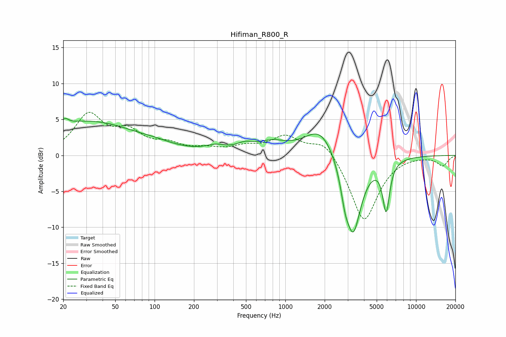

# Hifiman_R800_R
See [usage instructions](https://github.com/jaakkopasanen/AutoEq#usage) for more options and info.

### Parametric EQs
Apply preamp of -5.2 dB when using parametric equalizer.

|   # | Type    |   Fc (Hz) |    Q |   Gain (dB) |
|-----|---------|-----------|------|-------------|
|   1 | Peaking |        21 | 5.59 |         0.8 |
|   2 | Peaking |        31 | 0.36 |         4.7 |
|   3 | Peaking |       104 | 1.32 |         0.3 |
|   4 | Peaking |       294 | 1.78 |         0.8 |
|   5 | Peaking |       490 | 2.23 |         0.9 |
|   6 | Peaking |       785 | 1.24 |         1.4 |
|   7 | Peaking |      1875 | 1.16 |         4.2 |
|   8 | Peaking |      2860 | 4.57 |        -2.5 |
|   9 | Peaking |      3305 | 2.21 |       -11.1 |
|  10 | Peaking |      5907 | 5.21 |        -6.8 |

### Fixed Band EQs
When using fixed band (also called graphic) equalizer, apply preamp of **-6.1 dB** (if available) and set gains manually with these parameters.

|   # | Type    |   Fc (Hz) |    Q |   Gain (dB) |
|-----|---------|-----------|------|-------------|
|   1 | Peaking |        31 | 1.41 |         5.4 |
|   2 | Peaking |        62 | 1.41 |         2.8 |
|   3 | Peaking |       125 | 1.41 |         1.3 |
|   4 | Peaking |       250 | 1.41 |         0.7 |
|   5 | Peaking |       500 | 1.41 |         1   |
|   6 | Peaking |      1000 | 1.41 |         2.5 |
|   7 | Peaking |      2000 | 1.41 |         2.4 |
|   8 | Peaking |      4000 | 1.41 |        -9.3 |
|   9 | Peaking |      8000 | 1.41 |         0.1 |
|  10 | Peaking |     16000 | 1.41 |        -1.4 |

### Graphs

