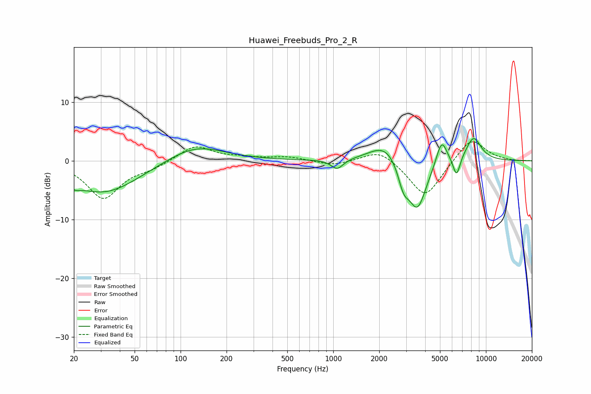

# Huawei_Freebuds_Pro_2_R
See [usage instructions](https://github.com/jaakkopasanen/AutoEq#usage) for more options and info.

### Parametric EQs
Apply preamp of -3.9 dB when using parametric equalizer.

|   # | Type    |   Fc (Hz) |    Q |   Gain (dB) |
|-----|---------|-----------|------|-------------|
|   1 | Peaking |        20 | 3.47 |        -1   |
|   2 | Peaking |        32 | 0.61 |        -5.5 |
|   3 | Peaking |       124 | 0.76 |         2.9 |
|   4 | Peaking |      1060 | 3.58 |        -1.7 |
|   5 | Peaking |      2222 | 1.34 |         3.5 |
|   6 | Peaking |      2885 | 3.85 |        -3.7 |
|   7 | Peaking |      3555 | 2.25 |        -8.6 |
|   8 | Peaking |      5126 | 3.84 |         4.5 |
|   9 | Peaking |      6422 | 5.78 |        -3.5 |
|  10 | Peaking |      8289 | 2.55 |         4.1 |

### Fixed Band EQs
When using fixed band (also called graphic) equalizer, apply preamp of **-3.3 dB** (if available) and set gains manually with these parameters.

|   # | Type    |   Fc (Hz) |    Q |   Gain (dB) |
|-----|---------|-----------|------|-------------|
|   1 | Peaking |        31 | 1.41 |        -6.3 |
|   2 | Peaking |        62 | 1.41 |        -1   |
|   3 | Peaking |       125 | 1.41 |         2.7 |
|   4 | Peaking |       250 | 1.41 |         0.4 |
|   5 | Peaking |       500 | 1.41 |         0.6 |
|   6 | Peaking |      1000 | 1.41 |        -0.8 |
|   7 | Peaking |      2000 | 1.41 |         2.1 |
|   8 | Peaking |      4000 | 1.41 |        -6.4 |
|   9 | Peaking |      8000 | 1.41 |         4.1 |
|  10 | Peaking |     16000 | 1.41 |        -0.1 |

### Graphs

