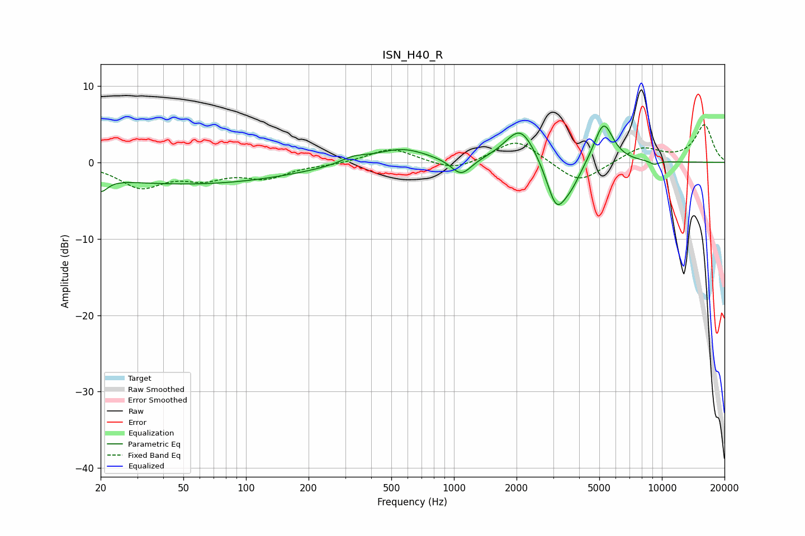

# ISN_H40_R
See [usage instructions](https://github.com/jaakkopasanen/AutoEq#usage) for more options and info.

### Parametric EQs
Apply preamp of -4.8 dB when using parametric equalizer.

|   # | Type    |   Fc (Hz) |    Q |   Gain (dB) |
|-----|---------|-----------|------|-------------|
|   1 | Peaking |        20 | 4.3  |        -1.8 |
|   2 | Peaking |        53 | 0.28 |        -2.8 |
|   3 | Peaking |       330 | 2.13 |         0.8 |
|   4 | Peaking |       560 | 1.13 |         1.9 |
|   5 | Peaking |      1084 | 2.89 |        -2.3 |
|   6 | Peaking |      2091 | 1.92 |         4.8 |
|   7 | Peaking |      3102 | 2.96 |        -5.8 |
|   8 | Peaking |      3656 | 2.6  |        -2.5 |
|   9 | Peaking |      5241 | 3    |         5.4 |
|  10 | Peaking |      9183 | 5.57 |        -0.5 |

### Fixed Band EQs
When using fixed band (also called graphic) equalizer, apply preamp of **-5.0 dB** (if available) and set gains manually with these parameters.

|   # | Type    |   Fc (Hz) |    Q |   Gain (dB) |
|-----|---------|-----------|------|-------------|
|   1 | Peaking |        31 | 1.41 |        -3.1 |
|   2 | Peaking |        62 | 1.41 |        -1.7 |
|   3 | Peaking |       125 | 1.41 |        -1.8 |
|   4 | Peaking |       250 | 1.41 |        -0.2 |
|   5 | Peaking |       500 | 1.41 |         1.9 |
|   6 | Peaking |      1000 | 1.41 |        -1.2 |
|   7 | Peaking |      2000 | 1.41 |         3.1 |
|   8 | Peaking |      4000 | 1.41 |        -2.9 |
|   9 | Peaking |      8000 | 1.41 |         1.9 |
|  10 | Peaking |     16000 | 1.41 |         4.9 |

### Graphs

