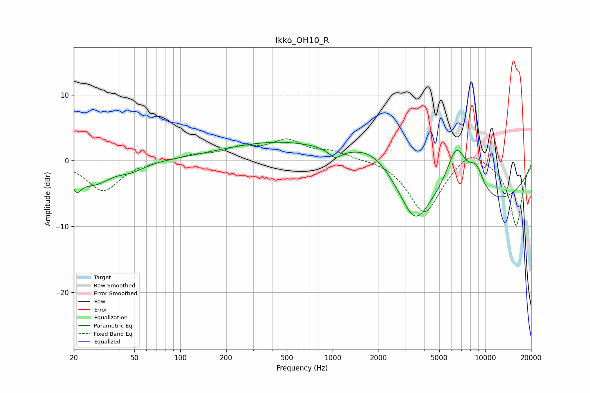

# Ikko_OH10_R
See [usage instructions](https://github.com/jaakkopasanen/AutoEq#usage) for more options and info.

### Parametric EQs
Apply preamp of -2.9 dB when using parametric equalizer.

|   # | Type    |   Fc (Hz) |    Q |   Gain (dB) |
|-----|---------|-----------|------|-------------|
|   1 | Peaking |        21 | 4.84 |        -2.4 |
|   2 | Peaking |        27 | 1.26 |        -3.3 |
|   3 | Peaking |        48 | 1.64 |        -1.1 |
|   4 | Peaking |      1036 | 3.43 |        -1.4 |
|   5 | Peaking |      1108 | 0.18 |         4.1 |
|   6 | Peaking |      1823 | 1.05 |         3.1 |
|   7 | Peaking |      3458 | 1.54 |        -6.1 |
|   8 | Peaking |      6320 | 0.2  |        -8.3 |
|   9 | Peaking |      6475 | 1.92 |         7.9 |
|  10 | Peaking |      8744 | 2.48 |         4   |

### Fixed Band EQs
When using fixed band (also called graphic) equalizer, apply preamp of **-3.4 dB** (if available) and set gains manually with these parameters.

|   # | Type    |   Fc (Hz) |    Q |   Gain (dB) |
|-----|---------|-----------|------|-------------|
|   1 | Peaking |        31 | 1.41 |        -4.6 |
|   2 | Peaking |        62 | 1.41 |         0   |
|   3 | Peaking |       125 | 1.41 |         0.8 |
|   4 | Peaking |       250 | 1.41 |         1.7 |
|   5 | Peaking |       500 | 1.41 |         2.8 |
|   6 | Peaking |      1000 | 1.41 |         1.2 |
|   7 | Peaking |      2000 | 1.41 |         0.3 |
|   8 | Peaking |      4000 | 1.41 |        -8.1 |
|   9 | Peaking |      8000 | 1.41 |         2.2 |
|  10 | Peaking |     16000 | 1.41 |        -9.9 |

### Graphs

