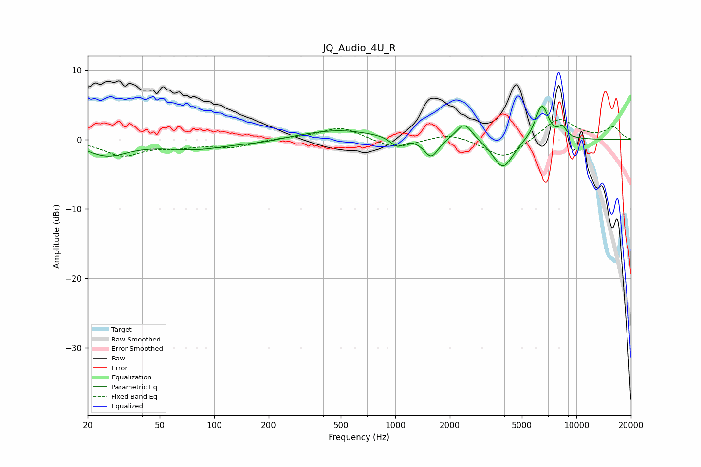

# JQ_Audio_4U_R
See [usage instructions](https://github.com/jaakkopasanen/AutoEq#usage) for more options and info.

### Parametric EQs
Apply preamp of -4.9 dB when using parametric equalizer.

|   # | Type    |   Fc (Hz) |    Q |   Gain (dB) |
|-----|---------|-----------|------|-------------|
|   1 | Peaking |        26 | 1.25 |        -2.2 |
|   2 | Peaking |        79 | 0.75 |        -1.3 |
|   3 | Peaking |       186 | 1.33 |        -0.3 |
|   4 | Peaking |       480 | 0.68 |         1.4 |
|   5 | Peaking |      1025 | 3.93 |        -1.4 |
|   6 | Peaking |      1579 | 3.65 |        -2.7 |
|   7 | Peaking |      2404 | 3.15 |         2.6 |
|   8 | Peaking |      3934 | 2.5  |        -4.3 |
|   9 | Peaking |      6442 | 3.72 |         5.1 |
|  10 | Peaking |      8368 | 5.76 |         1.4 |

### Fixed Band EQs
When using fixed band (also called graphic) equalizer, apply preamp of **-3.0 dB** (if available) and set gains manually with these parameters.

|   # | Type    |   Fc (Hz) |    Q |   Gain (dB) |
|-----|---------|-----------|------|-------------|
|   1 | Peaking |        31 | 1.41 |        -2.2 |
|   2 | Peaking |        62 | 1.41 |        -0.8 |
|   3 | Peaking |       125 | 1.41 |        -1   |
|   4 | Peaking |       250 | 1.41 |         0.2 |
|   5 | Peaking |       500 | 1.41 |         1.8 |
|   6 | Peaking |      1000 | 1.41 |        -1.4 |
|   7 | Peaking |      2000 | 1.41 |         1   |
|   8 | Peaking |      4000 | 1.41 |        -2.9 |
|   9 | Peaking |      8000 | 1.41 |         3.2 |
|  10 | Peaking |     16000 | 1.41 |         1.7 |

### Graphs

