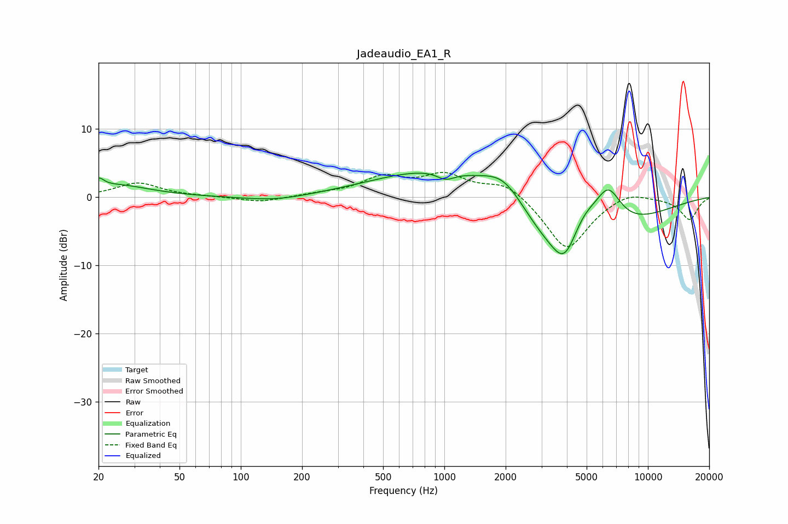

# Jadeaudio_EA1_R
See [usage instructions](https://github.com/jaakkopasanen/AutoEq#usage) for more options and info.

### Parametric EQs
Apply preamp of -3.6 dB when using parametric equalizer.

|   # | Type    |   Fc (Hz) |    Q |   Gain (dB) |
|-----|---------|-----------|------|-------------|
|   1 | Peaking |        20 | 5.9  |         1.2 |
|   2 | Peaking |        24 | 0.87 |         1.7 |
|   3 | Peaking |       149 | 0.9  |        -0.7 |
|   4 | Peaking |      1015 | 3.27 |        -1.2 |
|   5 | Peaking |      1047 | 0.44 |         5.2 |
|   6 | Peaking |      1976 | 1.26 |         4.7 |
|   7 | Peaking |      3893 | 2.51 |        -3.6 |
|   8 | Peaking |      3980 | 0.53 |       -11.6 |
|   9 | Peaking |      4837 | 1.67 |         5.3 |
|  10 | Peaking |      6377 | 1.99 |         6.4 |

### Fixed Band EQs
When using fixed band (also called graphic) equalizer, apply preamp of **-3.7 dB** (if available) and set gains manually with these parameters.

|   # | Type    |   Fc (Hz) |    Q |   Gain (dB) |
|-----|---------|-----------|------|-------------|
|   1 | Peaking |        31 | 1.41 |         2.1 |
|   2 | Peaking |        62 | 1.41 |         0.1 |
|   3 | Peaking |       125 | 1.41 |        -0.8 |
|   4 | Peaking |       250 | 1.41 |         0.4 |
|   5 | Peaking |       500 | 1.41 |         2.7 |
|   6 | Peaking |      1000 | 1.41 |         3   |
|   7 | Peaking |      2000 | 1.41 |         2.3 |
|   8 | Peaking |      4000 | 1.41 |        -7.9 |
|   9 | Peaking |      8000 | 1.41 |         1.2 |
|  10 | Peaking |     16000 | 1.41 |        -3.3 |

### Graphs

