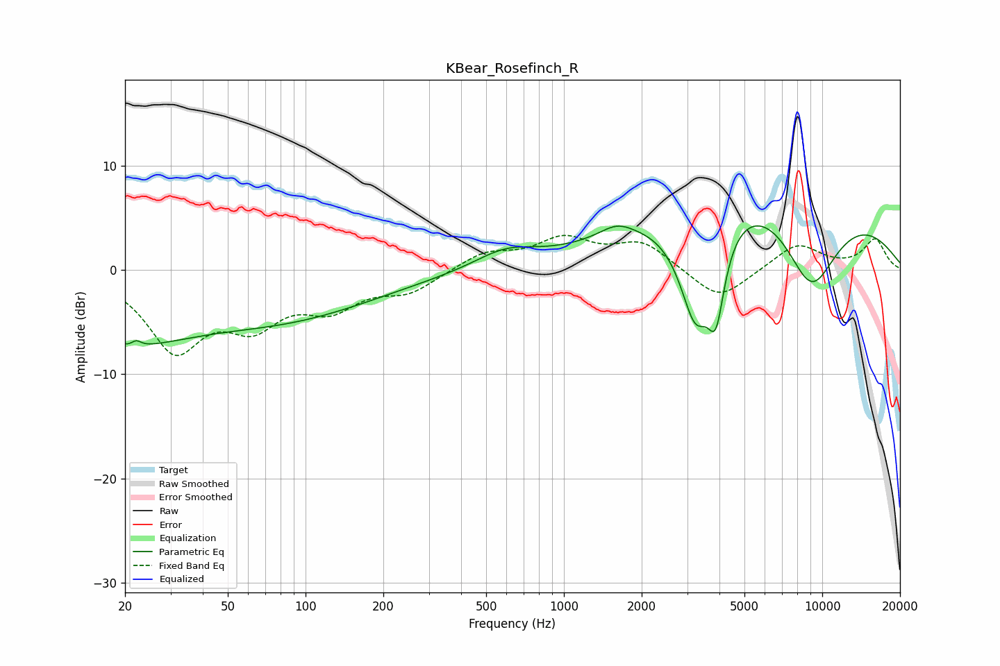

# KBear_Rosefinch_R
See [usage instructions](https://github.com/jaakkopasanen/AutoEq#usage) for more options and info.

### Parametric EQs
Apply preamp of -4.3 dB when using parametric equalizer.

|   # | Type    |   Fc (Hz) |    Q |   Gain (dB) |
|-----|---------|-----------|------|-------------|
|   1 | Peaking |        20 | 0.55 |        -5.7 |
|   2 | Peaking |        22 | 4.87 |        -2.8 |
|   3 | Peaking |        22 | 5.59 |         3.1 |
|   4 | Peaking |        84 | 0.4  |        -4.2 |
|   5 | Peaking |       592 | 1.19 |         1.7 |
|   6 | Peaking |      1603 | 2.18 |         1.1 |
|   7 | Peaking |      3229 | 2.09 |       -10.5 |
|   8 | Peaking |      3880 | 4.25 |        -6.9 |
|   9 | Peaking |      6711 | 0.29 |        11.1 |
|  10 | Peaking |      9035 | 1.01 |       -11.1 |

### Fixed Band EQs
When using fixed band (also called graphic) equalizer, apply preamp of **-3.4 dB** (if available) and set gains manually with these parameters.

|   # | Type    |   Fc (Hz) |    Q |   Gain (dB) |
|-----|---------|-----------|------|-------------|
|   1 | Peaking |        31 | 1.41 |        -7.3 |
|   2 | Peaking |        62 | 1.41 |        -4.3 |
|   3 | Peaking |       125 | 1.41 |        -3.1 |
|   4 | Peaking |       250 | 1.41 |        -1.9 |
|   5 | Peaking |       500 | 1.41 |         1.6 |
|   6 | Peaking |      1000 | 1.41 |         2.8 |
|   7 | Peaking |      2000 | 1.41 |         2.5 |
|   8 | Peaking |      4000 | 1.41 |        -3.1 |
|   9 | Peaking |      8000 | 1.41 |         2.5 |
|  10 | Peaking |     16000 | 1.41 |         2.9 |

### Graphs

