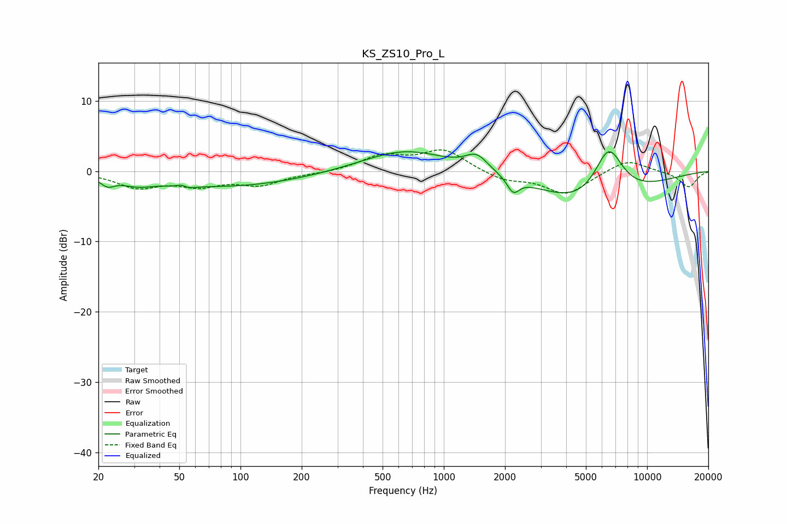

# KS_ZS10_Pro_L
See [usage instructions](https://github.com/jaakkopasanen/AutoEq#usage) for more options and info.

### Parametric EQs
Apply preamp of -2.9 dB when using parametric equalizer.

|   # | Type    |   Fc (Hz) |    Q |   Gain (dB) |
|-----|---------|-----------|------|-------------|
|   1 | Peaking |        22 | 4.19 |        -1.1 |
|   2 | Peaking |        31 | 1.79 |        -1   |
|   3 | Peaking |        52 | 4.77 |         1.8 |
|   4 | Peaking |        52 | 3.96 |        -1.9 |
|   5 | Peaking |        88 | 0.38 |        -2.2 |
|   6 | Peaking |       648 | 0.68 |         3.1 |
|   7 | Peaking |      1453 | 2.57 |         2.2 |
|   8 | Peaking |      2194 | 4.89 |        -2.1 |
|   9 | Peaking |      5528 | 0.59 |        -6.1 |
|  10 | Peaking |      6462 | 1.75 |         8.5 |

### Fixed Band EQs
When using fixed band (also called graphic) equalizer, apply preamp of **-3.1 dB** (if available) and set gains manually with these parameters.

|   # | Type    |   Fc (Hz) |    Q |   Gain (dB) |
|-----|---------|-----------|------|-------------|
|   1 | Peaking |        31 | 1.41 |        -2.1 |
|   2 | Peaking |        62 | 1.41 |        -1.8 |
|   3 | Peaking |       125 | 1.41 |        -1.8 |
|   4 | Peaking |       250 | 1.41 |        -0.2 |
|   5 | Peaking |       500 | 1.41 |         2.1 |
|   6 | Peaking |      1000 | 1.41 |         3   |
|   7 | Peaking |      2000 | 1.41 |        -1.3 |
|   8 | Peaking |      4000 | 1.41 |        -3.2 |
|   9 | Peaking |      8000 | 1.41 |         1.8 |
|  10 | Peaking |     16000 | 1.41 |        -2.3 |

### Graphs

