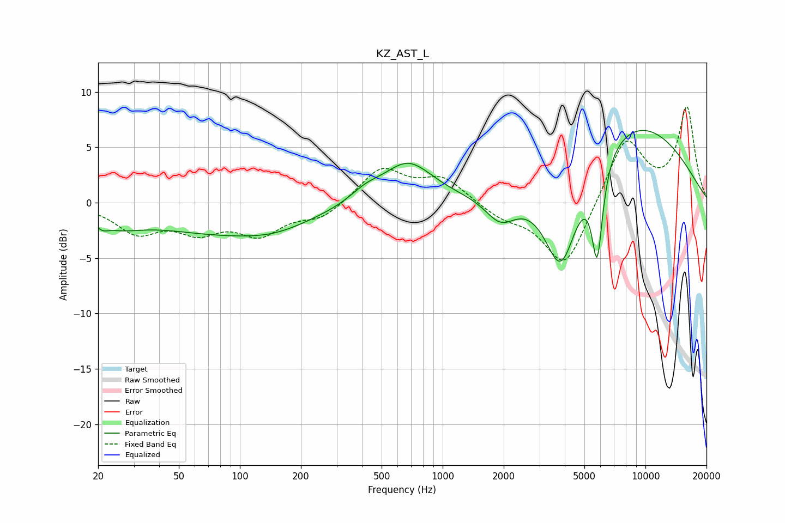

# KZ_AST_L
See [usage instructions](https://github.com/jaakkopasanen/AutoEq#usage) for more options and info.

### Parametric EQs
Apply preamp of -6.6 dB when using parametric equalizer.

|   # | Type    |   Fc (Hz) |    Q |   Gain (dB) |
|-----|---------|-----------|------|-------------|
|   1 | Peaking |        21 | 4.87 |        -0.6 |
|   2 | Peaking |        25 | 1.2  |        -1.3 |
|   3 | Peaking |        88 | 0.37 |        -2.7 |
|   4 | Peaking |       149 | 0.93 |        -0.6 |
|   5 | Peaking |       416 | 1.82 |         0.9 |
|   6 | Peaking |       673 | 1.14 |         3.6 |
|   7 | Peaking |      1934 | 1.82 |        -2.5 |
|   8 | Peaking |      3834 | 1.61 |        -9.4 |
|   9 | Peaking |      5782 | 5.01 |        -8.5 |
|  10 | Peaking |      8259 | 0.38 |         7.6 |

### Fixed Band EQs
When using fixed band (also called graphic) equalizer, apply preamp of **-8.8 dB** (if available) and set gains manually with these parameters.

|   # | Type    |   Fc (Hz) |    Q |   Gain (dB) |
|-----|---------|-----------|------|-------------|
|   1 | Peaking |        31 | 1.41 |        -2.5 |
|   2 | Peaking |        62 | 1.41 |        -2.2 |
|   3 | Peaking |       125 | 1.41 |        -2.6 |
|   4 | Peaking |       250 | 1.41 |        -1.4 |
|   5 | Peaking |       500 | 1.41 |         3.1 |
|   6 | Peaking |      1000 | 1.41 |         2.2 |
|   7 | Peaking |      2000 | 1.41 |        -1.2 |
|   8 | Peaking |      4000 | 1.41 |        -6   |
|   9 | Peaking |      8000 | 1.41 |         6   |
|  10 | Peaking |     16000 | 1.41 |         8.5 |

### Graphs

