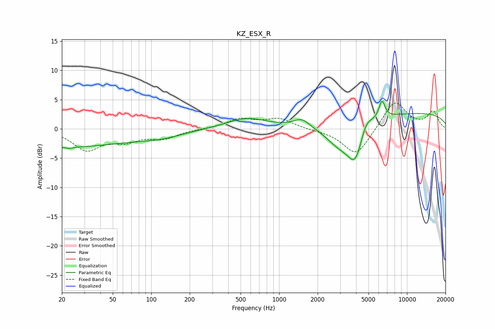

# KZ_ESX_R
See [usage instructions](https://github.com/jaakkopasanen/AutoEq#usage) for more options and info.

### Parametric EQs
Apply preamp of -4.8 dB when using parametric equalizer.

|   # | Type    |   Fc (Hz) |    Q |   Gain (dB) |
|-----|---------|-----------|------|-------------|
|   1 | Peaking |        22 | 0.28 |        -3   |
|   2 | Peaking |        23 | 4.89 |        -0.3 |
|   3 | Peaking |       119 | 0.8  |        -1   |
|   4 | Peaking |       557 | 0.9  |         1.8 |
|   5 | Peaking |      1505 | 2.31 |         1.4 |
|   6 | Peaking |      2952 | 1.23 |        -3.7 |
|   7 | Peaking |      3957 | 2.25 |        -6.1 |
|   8 | Peaking |      4758 | 2.8  |         2.5 |
|   9 | Peaking |      6372 | 5.71 |         3   |
|  10 | Peaking |     10000 | 0.19 |         2.8 |

### Fixed Band EQs
When using fixed band (also called graphic) equalizer, apply preamp of **-4.5 dB** (if available) and set gains manually with these parameters.

|   # | Type    |   Fc (Hz) |    Q |   Gain (dB) |
|-----|---------|-----------|------|-------------|
|   1 | Peaking |        31 | 1.41 |        -3.5 |
|   2 | Peaking |        62 | 1.41 |        -1.7 |
|   3 | Peaking |       125 | 1.41 |        -1.5 |
|   4 | Peaking |       250 | 1.41 |        -0   |
|   5 | Peaking |       500 | 1.41 |         1.6 |
|   6 | Peaking |      1000 | 1.41 |         1.7 |
|   7 | Peaking |      2000 | 1.41 |        -0.2 |
|   8 | Peaking |      4000 | 1.41 |        -4.7 |
|   9 | Peaking |      8000 | 1.41 |         4.9 |
|  10 | Peaking |     16000 | 1.41 |         2.9 |

### Graphs

