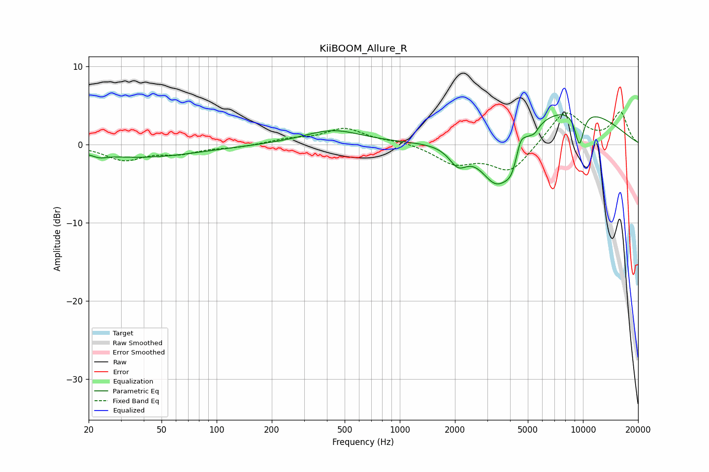

# KiiBOOM_Allure_R
See [usage instructions](https://github.com/jaakkopasanen/AutoEq#usage) for more options and info.

### Parametric EQs
Apply preamp of -3.9 dB when using parametric equalizer.

|   # | Type    |   Fc (Hz) |    Q |   Gain (dB) |
|-----|---------|-----------|------|-------------|
|   1 | Peaking |        23 | 3.98 |        -0.4 |
|   2 | Peaking |        39 | 0.45 |        -1.6 |
|   3 | Peaking |       430 | 0.89 |         1.8 |
|   4 | Peaking |      2080 | 2.89 |        -2.4 |
|   5 | Peaking |      3370 | 1.55 |        -6.6 |
|   6 | Peaking |      4096 | 3.36 |        -2.8 |
|   7 | Peaking |      4555 | 5.92 |         1.8 |
|   8 | Peaking |      5424 | 6    |        -0.7 |
|   9 | Peaking |      8089 | 0.41 |         5   |
|  10 | Peaking |      9553 | 5    |        -4.3 |

### Fixed Band EQs
When using fixed band (also called graphic) equalizer, apply preamp of **-4.3 dB** (if available) and set gains manually with these parameters.

|   # | Type    |   Fc (Hz) |    Q |   Gain (dB) |
|-----|---------|-----------|------|-------------|
|   1 | Peaking |        31 | 1.41 |        -1.9 |
|   2 | Peaking |        62 | 1.41 |        -1   |
|   3 | Peaking |       125 | 1.41 |        -0.3 |
|   4 | Peaking |       250 | 1.41 |         0.6 |
|   5 | Peaking |       500 | 1.41 |         2   |
|   6 | Peaking |      1000 | 1.41 |         0.4 |
|   7 | Peaking |      2000 | 1.41 |        -2.3 |
|   8 | Peaking |      4000 | 1.41 |        -3.5 |
|   9 | Peaking |      8000 | 1.41 |         4.3 |
|  10 | Peaking |     16000 | 1.41 |         4   |

### Graphs

