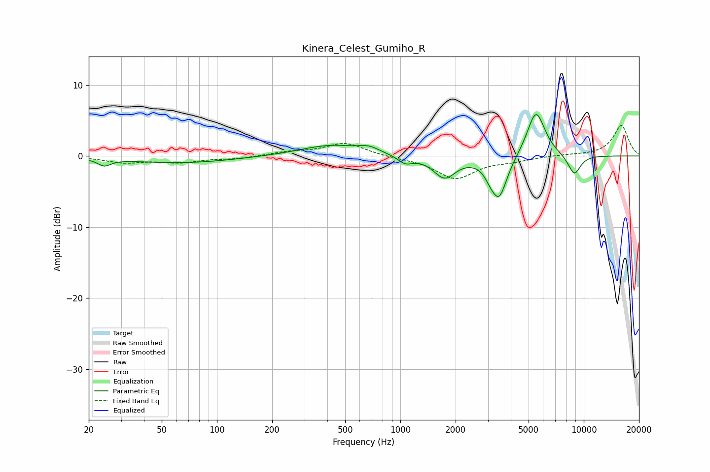

# Kinera_Celest_Gumiho_R
See [usage instructions](https://github.com/jaakkopasanen/AutoEq#usage) for more options and info.

### Parametric EQs
Apply preamp of -5.9 dB when using parametric equalizer.

|   # | Type    |   Fc (Hz) |    Q |   Gain (dB) |
|-----|---------|-----------|------|-------------|
|   1 | Peaking |        24 | 4.01 |        -1   |
|   2 | Peaking |        63 | 0.48 |        -1   |
|   3 | Peaking |       422 | 0.82 |         1.6 |
|   4 | Peaking |       675 | 2.75 |         0.7 |
|   5 | Peaking |      1063 | 3.48 |        -1.1 |
|   6 | Peaking |      1742 | 2.35 |        -3   |
|   7 | Peaking |      3079 | 5.01 |        -0.8 |
|   8 | Peaking |      3449 | 3.11 |        -5.8 |
|   9 | Peaking |      5486 | 2.79 |         6.6 |
|  10 | Peaking |      8874 | 3.64 |        -2.8 |

### Fixed Band EQs
When using fixed band (also called graphic) equalizer, apply preamp of **-4.4 dB** (if available) and set gains manually with these parameters.

|   # | Type    |   Fc (Hz) |    Q |   Gain (dB) |
|-----|---------|-----------|------|-------------|
|   1 | Peaking |        31 | 1.41 |        -0.9 |
|   2 | Peaking |        62 | 1.41 |        -0.8 |
|   3 | Peaking |       125 | 1.41 |        -0.4 |
|   4 | Peaking |       250 | 1.41 |         0.5 |
|   5 | Peaking |       500 | 1.41 |         1.8 |
|   6 | Peaking |      1000 | 1.41 |        -0.2 |
|   7 | Peaking |      2000 | 1.41 |        -3.1 |
|   8 | Peaking |      4000 | 1.41 |        -0.5 |
|   9 | Peaking |      8000 | 1.41 |         0.1 |
|  10 | Peaking |     16000 | 1.41 |         4.3 |

### Graphs

