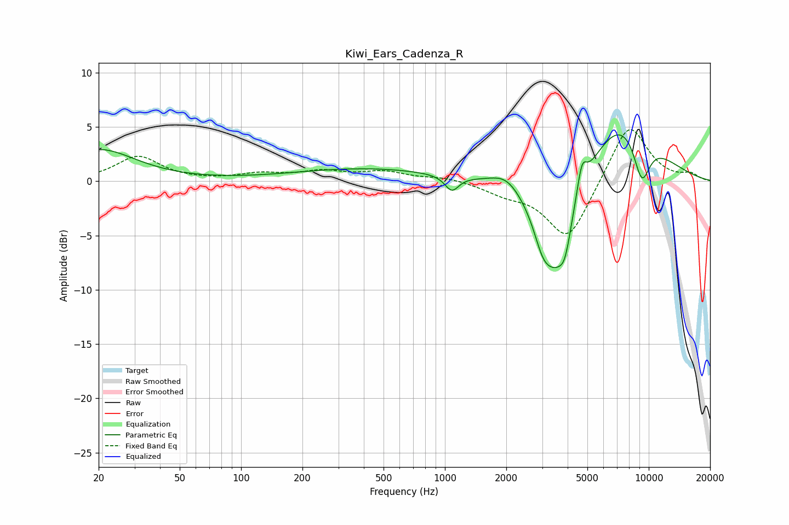

# Kiwi_Ears_Cadenza_R
See [usage instructions](https://github.com/jaakkopasanen/AutoEq#usage) for more options and info.

### Parametric EQs
Apply preamp of -4.4 dB when using parametric equalizer.

|   # | Type    |   Fc (Hz) |    Q |   Gain (dB) |
|-----|---------|-----------|------|-------------|
|   1 | Peaking |        20 | 0.79 |         2.9 |
|   2 | Peaking |       415 | 0.39 |         1.2 |
|   3 | Peaking |      1082 | 4.23 |        -1.4 |
|   4 | Peaking |      2008 | 1.87 |         1.3 |
|   5 | Peaking |      3012 | 3.38 |        -2   |
|   6 | Peaking |      3511 | 1.54 |        -8.9 |
|   7 | Peaking |      3883 | 5.14 |        -1.9 |
|   8 | Peaking |      4696 | 6    |         2.6 |
|   9 | Peaking |      7378 | 0.74 |         6.4 |
|  10 | Peaking |      9240 | 2.93 |        -4.5 |

### Fixed Band EQs
When using fixed band (also called graphic) equalizer, apply preamp of **-4.8 dB** (if available) and set gains manually with these parameters.

|   # | Type    |   Fc (Hz) |    Q |   Gain (dB) |
|-----|---------|-----------|------|-------------|
|   1 | Peaking |        31 | 1.41 |         2.3 |
|   2 | Peaking |        62 | 1.41 |        -0   |
|   3 | Peaking |       125 | 1.41 |         0.6 |
|   4 | Peaking |       250 | 1.41 |         0.8 |
|   5 | Peaking |       500 | 1.41 |         0.8 |
|   6 | Peaking |      1000 | 1.41 |         0.4 |
|   7 | Peaking |      2000 | 1.41 |        -0.9 |
|   8 | Peaking |      4000 | 1.41 |        -5.5 |
|   9 | Peaking |      8000 | 1.41 |         5.5 |
|  10 | Peaking |     16000 | 1.41 |         0.6 |

### Graphs

