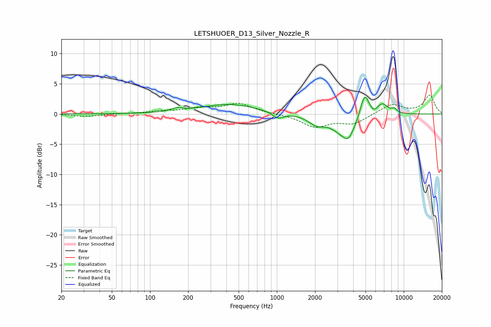

# LETSHUOER_D13_Silver_Nozzle_R
See [usage instructions](https://github.com/jaakkopasanen/AutoEq#usage) for more options and info.

### Parametric EQs
Apply preamp of -2.8 dB when using parametric equalizer.

|   # | Type    |   Fc (Hz) |    Q |   Gain (dB) |
|-----|---------|-----------|------|-------------|
|   1 | Peaking |       163 | 3.07 |         0.5 |
|   2 | Peaking |       423 | 0.64 |         1.6 |
|   3 | Peaking |      1018 | 3.36 |        -1   |
|   4 | Peaking |      2060 | 2.33 |        -1.3 |
|   5 | Peaking |      3549 | 1.51 |        -3.9 |
|   6 | Peaking |      3659 | 5.47 |        -0.7 |
|   7 | Peaking |      4910 | 3.78 |         4.4 |
|   8 | Peaking |      5831 | 4.85 |        -0.6 |
|   9 | Peaking |      6748 | 2.92 |         1.9 |
|  10 | Peaking |      8433 | 5.98 |         0.7 |

### Fixed Band EQs
When using fixed band (also called graphic) equalizer, apply preamp of **-3.2 dB** (if available) and set gains manually with these parameters.

|   # | Type    |   Fc (Hz) |    Q |   Gain (dB) |
|-----|---------|-----------|------|-------------|
|   1 | Peaking |        31 | 1.41 |        -0.4 |
|   2 | Peaking |        62 | 1.41 |         0   |
|   3 | Peaking |       125 | 1.41 |         0.4 |
|   4 | Peaking |       250 | 1.41 |         0.8 |
|   5 | Peaking |       500 | 1.41 |         1.7 |
|   6 | Peaking |      1000 | 1.41 |         0   |
|   7 | Peaking |      2000 | 1.41 |        -2.1 |
|   8 | Peaking |      4000 | 1.41 |        -1.5 |
|   9 | Peaking |      8000 | 1.41 |         1.6 |
|  10 | Peaking |     16000 | 1.41 |         3.1 |

### Graphs

