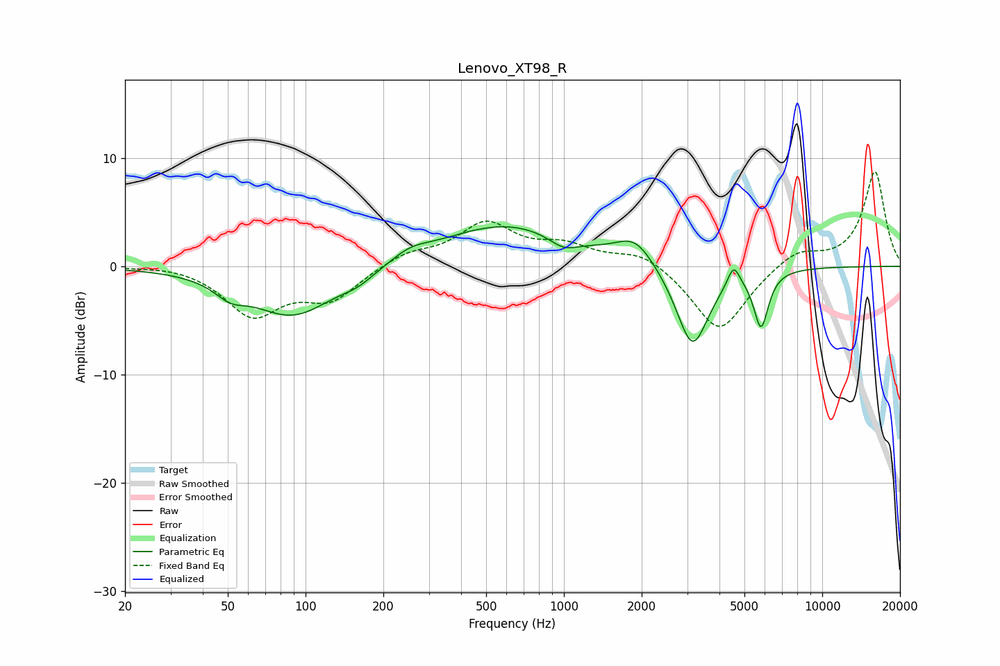

# Lenovo_XT98_R
See [usage instructions](https://github.com/jaakkopasanen/AutoEq#usage) for more options and info.

### Parametric EQs
Apply preamp of -3.7 dB when using parametric equalizer.

|   # | Type    |   Fc (Hz) |    Q |   Gain (dB) |
|-----|---------|-----------|------|-------------|
|   1 | Peaking |        51 | 2.47 |        -1.2 |
|   2 | Peaking |        89 | 0.87 |        -4.6 |
|   3 | Peaking |       160 | 2.16 |        -0.8 |
|   4 | Peaking |       254 | 1.99 |         0.8 |
|   5 | Peaking |       596 | 0.54 |         3.9 |
|   6 | Peaking |       997 | 2.44 |        -1.2 |
|   7 | Peaking |      1886 | 1.94 |         2.3 |
|   8 | Peaking |      3144 | 2.21 |        -7.7 |
|   9 | Peaking |      4538 | 6    |         2   |
|  10 | Peaking |      5798 | 4.91 |        -5.2 |

### Fixed Band EQs
When using fixed band (also called graphic) equalizer, apply preamp of **-8.8 dB** (if available) and set gains manually with these parameters.

|   # | Type    |   Fc (Hz) |    Q |   Gain (dB) |
|-----|---------|-----------|------|-------------|
|   1 | Peaking |        31 | 1.41 |         0.3 |
|   2 | Peaking |        62 | 1.41 |        -4.4 |
|   3 | Peaking |       125 | 1.41 |        -2.9 |
|   4 | Peaking |       250 | 1.41 |         1.2 |
|   5 | Peaking |       500 | 1.41 |         3.8 |
|   6 | Peaking |      1000 | 1.41 |         1.6 |
|   7 | Peaking |      2000 | 1.41 |         1.4 |
|   8 | Peaking |      4000 | 1.41 |        -6.2 |
|   9 | Peaking |      8000 | 1.41 |         1.6 |
|  10 | Peaking |     16000 | 1.41 |         8.7 |

### Graphs

