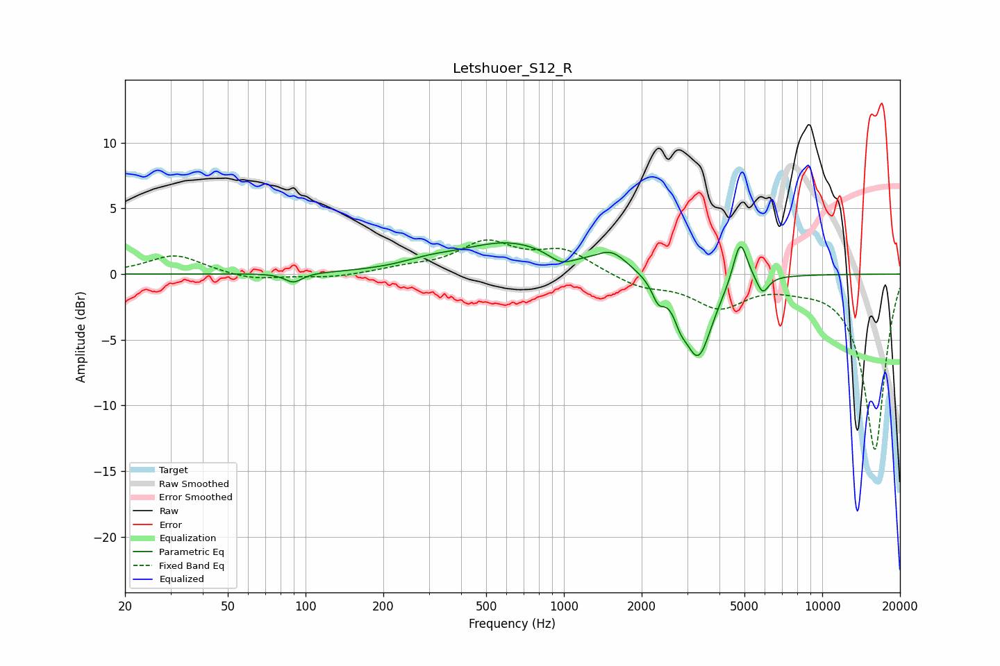

# Letshuoer_S12_R
See [usage instructions](https://github.com/jaakkopasanen/AutoEq#usage) for more options and info.

### Parametric EQs
Apply preamp of -2.5 dB when using parametric equalizer.

|   # | Type    |   Fc (Hz) |    Q |   Gain (dB) |
|-----|---------|-----------|------|-------------|
|   1 | Peaking |        90 | 4.22 |        -0.7 |
|   2 | Peaking |       300 | 1.41 |         0.4 |
|   3 | Peaking |       614 | 0.72 |         2.4 |
|   4 | Peaking |       973 | 3.04 |        -0.8 |
|   5 | Peaking |      1533 | 2.3  |         1.4 |
|   6 | Peaking |      2319 | 6    |        -1.4 |
|   7 | Peaking |      2823 | 6    |        -1.1 |
|   8 | Peaking |      3306 | 2.54 |        -6.3 |
|   9 | Peaking |      4813 | 5.06 |         3.4 |
|  10 | Peaking |      5879 | 6    |        -1.4 |

### Fixed Band EQs
When using fixed band (also called graphic) equalizer, apply preamp of **-2.7 dB** (if available) and set gains manually with these parameters.

|   # | Type    |   Fc (Hz) |    Q |   Gain (dB) |
|-----|---------|-----------|------|-------------|
|   1 | Peaking |        31 | 1.41 |         1.5 |
|   2 | Peaking |        62 | 1.41 |        -0.5 |
|   3 | Peaking |       125 | 1.41 |        -0.3 |
|   4 | Peaking |       250 | 1.41 |         0.4 |
|   5 | Peaking |       500 | 1.41 |         2.3 |
|   6 | Peaking |      1000 | 1.41 |         1.7 |
|   7 | Peaking |      2000 | 1.41 |        -0.9 |
|   8 | Peaking |      4000 | 1.41 |        -2.3 |
|   9 | Peaking |      8000 | 1.41 |        -0.5 |
|  10 | Peaking |     16000 | 1.41 |       -13.4 |

### Graphs

