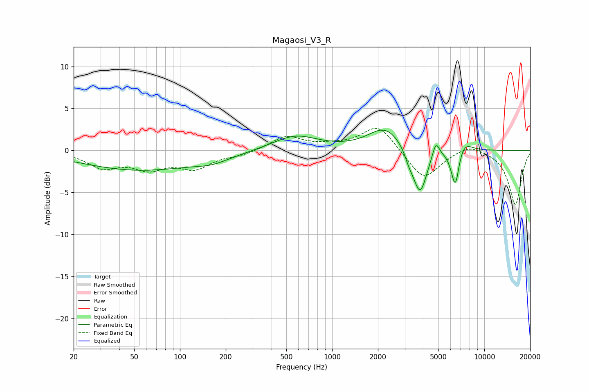

# Magaosi_V3_R
See [usage instructions](https://github.com/jaakkopasanen/AutoEq#usage) for more options and info.

### Parametric EQs
Apply preamp of -2.5 dB when using parametric equalizer.

|   # | Type    |   Fc (Hz) |    Q |   Gain (dB) |
|-----|---------|-----------|------|-------------|
|   1 | Peaking |        54 | 0.37 |        -2.3 |
|   2 | Peaking |       163 | 1.26 |        -0.7 |
|   3 | Peaking |       571 | 0.96 |         1.8 |
|   4 | Peaking |      2239 | 1.27 |         2.7 |
|   5 | Peaking |      3210 | 5    |        -1   |
|   6 | Peaking |      3778 | 3.05 |        -5.5 |
|   7 | Peaking |      4804 | 6    |         1.9 |
|   8 | Peaking |      6216 | 4.87 |        -1.1 |
|   9 | Peaking |      6480 | 5.98 |        -3.5 |
|  10 | Peaking |      7398 | 2.74 |         1.2 |

### Fixed Band EQs
When using fixed band (also called graphic) equalizer, apply preamp of **-2.7 dB** (if available) and set gains manually with these parameters.

|   # | Type    |   Fc (Hz) |    Q |   Gain (dB) |
|-----|---------|-----------|------|-------------|
|   1 | Peaking |        31 | 1.41 |        -1.9 |
|   2 | Peaking |        62 | 1.41 |        -1.9 |
|   3 | Peaking |       125 | 1.41 |        -1.9 |
|   4 | Peaking |       250 | 1.41 |        -0.5 |
|   5 | Peaking |       500 | 1.41 |         1.7 |
|   6 | Peaking |      1000 | 1.41 |         0.4 |
|   7 | Peaking |      2000 | 1.41 |         3.1 |
|   8 | Peaking |      4000 | 1.41 |        -3.6 |
|   9 | Peaking |      8000 | 1.41 |         0.9 |
|  10 | Peaking |     16000 | 1.41 |        -6.5 |

### Graphs

