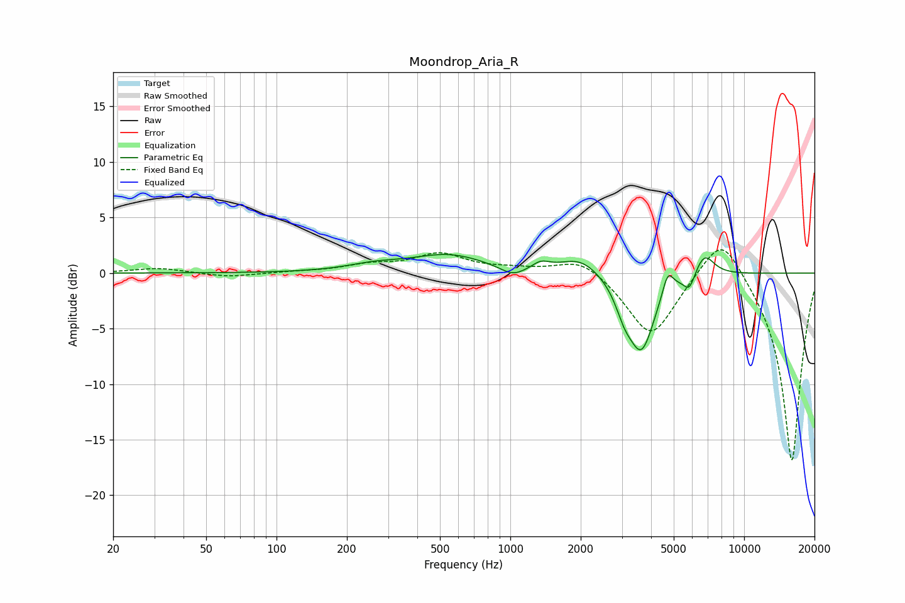

# Moondrop_Aria_R
See [usage instructions](https://github.com/jaakkopasanen/AutoEq#usage) for more options and info.

### Parametric EQs
Apply preamp of -1.8 dB when using parametric equalizer.

|   # | Type    |   Fc (Hz) |    Q |   Gain (dB) |
|-----|---------|-----------|------|-------------|
|   1 | Peaking |       263 | 1.18 |         0.6 |
|   2 | Peaking |       545 | 0.89 |         1.6 |
|   3 | Peaking |      1025 | 2.56 |        -0.9 |
|   4 | Peaking |      1349 | 3.84 |         0.7 |
|   5 | Peaking |      2001 | 1.62 |         1.5 |
|   6 | Peaking |      3066 | 3.94 |        -1.7 |
|   7 | Peaking |      3636 | 2.42 |        -6.8 |
|   8 | Peaking |      4716 | 6    |         2   |
|   9 | Peaking |      5833 | 5.73 |        -1.5 |
|  10 | Peaking |      6758 | 3.25 |         2.1 |

### Fixed Band EQs
When using fixed band (also called graphic) equalizer, apply preamp of **-2.2 dB** (if available) and set gains manually with these parameters.

|   # | Type    |   Fc (Hz) |    Q |   Gain (dB) |
|-----|---------|-----------|------|-------------|
|   1 | Peaking |        31 | 1.41 |         0.5 |
|   2 | Peaking |        62 | 1.41 |        -0.4 |
|   3 | Peaking |       125 | 1.41 |         0.1 |
|   4 | Peaking |       250 | 1.41 |         0.6 |
|   5 | Peaking |       500 | 1.41 |         1.6 |
|   6 | Peaking |      1000 | 1.41 |         0.3 |
|   7 | Peaking |      2000 | 1.41 |         1.5 |
|   8 | Peaking |      4000 | 1.41 |        -5.8 |
|   9 | Peaking |      8000 | 1.41 |         4.3 |
|  10 | Peaking |     16000 | 1.41 |       -17.2 |

### Graphs

