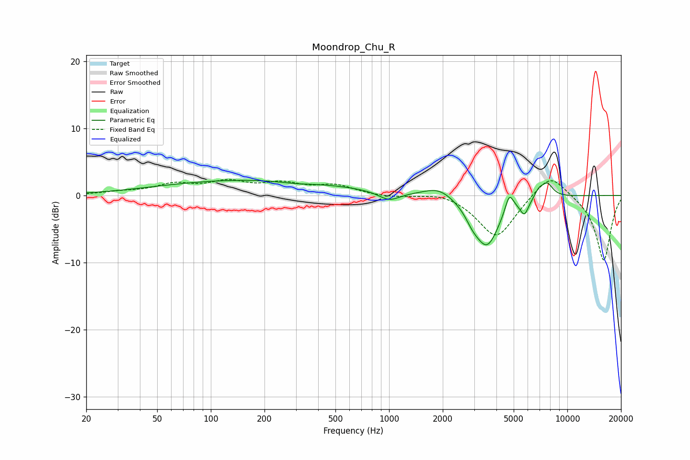

# Moondrop_Chu_R
See [usage instructions](https://github.com/jaakkopasanen/AutoEq#usage) for more options and info.

### Parametric EQs
Apply preamp of -2.3 dB when using parametric equalizer.

|   # | Type    |   Fc (Hz) |    Q |   Gain (dB) |
|-----|---------|-----------|------|-------------|
|   1 | Peaking |       173 | 0.26 |         2.3 |
|   2 | Peaking |       302 | 1.37 |        -0.3 |
|   3 | Peaking |      1001 | 2.39 |        -1.3 |
|   4 | Peaking |      1900 | 1.71 |         1.5 |
|   5 | Peaking |      2941 | 3.5  |        -1.3 |
|   6 | Peaking |      3544 | 1.98 |        -7.3 |
|   7 | Peaking |      4721 | 5.96 |         2.8 |
|   8 | Peaking |      5744 | 5.96 |        -2.1 |
|   9 | Peaking |      6919 | 6    |         1   |
|  10 | Peaking |      7689 | 4.02 |         2.1 |

### Fixed Band EQs
When using fixed band (also called graphic) equalizer, apply preamp of **-2.5 dB** (if available) and set gains manually with these parameters.

|   # | Type    |   Fc (Hz) |    Q |   Gain (dB) |
|-----|---------|-----------|------|-------------|
|   1 | Peaking |        31 | 1.41 |         0.4 |
|   2 | Peaking |        62 | 1.41 |         1.5 |
|   3 | Peaking |       125 | 1.41 |         1.8 |
|   4 | Peaking |       250 | 1.41 |         1.5 |
|   5 | Peaking |       500 | 1.41 |         1.4 |
|   6 | Peaking |      1000 | 1.41 |        -0.3 |
|   7 | Peaking |      2000 | 1.41 |         0.7 |
|   8 | Peaking |      4000 | 1.41 |        -6.4 |
|   9 | Peaking |      8000 | 1.41 |         3.7 |
|  10 | Peaking |     16000 | 1.41 |        -9.8 |

### Graphs

