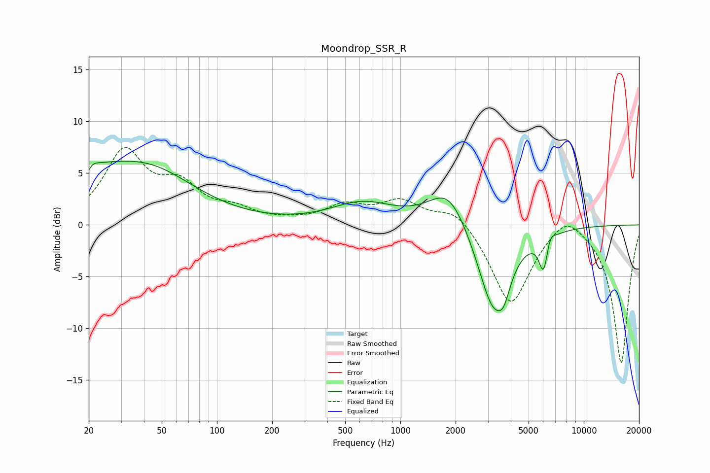

# Moondrop_SSR_R
See [usage instructions](https://github.com/jaakkopasanen/AutoEq#usage) for more options and info.

### Parametric EQs
Apply preamp of -6.3 dB when using parametric equalizer.

|   # | Type    |   Fc (Hz) |    Q |   Gain (dB) |
|-----|---------|-----------|------|-------------|
|   1 | Peaking |        20 | 5.97 |        -3.9 |
|   2 | Peaking |        20 | 5.59 |         3.5 |
|   3 | Peaking |        21 | 0.31 |         5.1 |
|   4 | Peaking |        46 | 0.67 |         1.7 |
|   5 | Peaking |       622 | 0.82 |         2   |
|   6 | Peaking |      1835 | 1.31 |         3.9 |
|   7 | Peaking |      3205 | 1.6  |        -8.4 |
|   8 | Peaking |      3660 | 4.22 |        -1.8 |
|   9 | Peaking |      6047 | 5.34 |        -3.6 |
|  10 | Peaking |      6527 | 5.98 |         1.3 |

### Fixed Band EQs
When using fixed band (also called graphic) equalizer, apply preamp of **-7.6 dB** (if available) and set gains manually with these parameters.

|   # | Type    |   Fc (Hz) |    Q |   Gain (dB) |
|-----|---------|-----------|------|-------------|
|   1 | Peaking |        31 | 1.41 |         6.8 |
|   2 | Peaking |        62 | 1.41 |         3.2 |
|   3 | Peaking |       125 | 1.41 |         1.2 |
|   4 | Peaking |       250 | 1.41 |         0.2 |
|   5 | Peaking |       500 | 1.41 |         1.7 |
|   6 | Peaking |      1000 | 1.41 |         2.2 |
|   7 | Peaking |      2000 | 1.41 |         1.8 |
|   8 | Peaking |      4000 | 1.41 |        -7.9 |
|   9 | Peaking |      8000 | 1.41 |         1.9 |
|  10 | Peaking |     16000 | 1.41 |       -13.4 |

### Graphs

