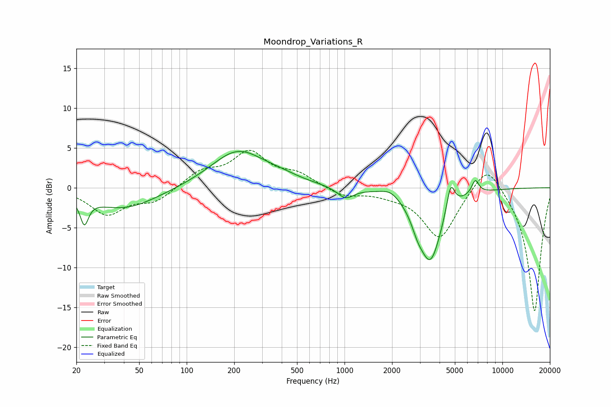

# Moondrop_Variations_R
See [usage instructions](https://github.com/jaakkopasanen/AutoEq#usage) for more options and info.

### Parametric EQs
Apply preamp of -4.7 dB when using parametric equalizer.

|   # | Type    |   Fc (Hz) |    Q |   Gain (dB) |
|-----|---------|-----------|------|-------------|
|   1 | Peaking |        22 | 5.42 |        -3.2 |
|   2 | Peaking |        40 | 0.67 |        -2.7 |
|   3 | Peaking |       211 | 0.83 |         4.6 |
|   4 | Peaking |       396 | 1.18 |         0.6 |
|   5 | Peaking |      1014 | 2.69 |        -1.4 |
|   6 | Peaking |      1957 | 2.47 |         0.8 |
|   7 | Peaking |      2894 | 3.81 |        -1.4 |
|   8 | Peaking |      3496 | 1.92 |        -8.9 |
|   9 | Peaking |      4700 | 5.39 |         3.6 |
|  10 | Peaking |      6739 | 6    |         1.7 |

### Fixed Band EQs
When using fixed band (also called graphic) equalizer, apply preamp of **-4.8 dB** (if available) and set gains manually with these parameters.

|   # | Type    |   Fc (Hz) |    Q |   Gain (dB) |
|-----|---------|-----------|------|-------------|
|   1 | Peaking |        31 | 1.41 |        -3.3 |
|   2 | Peaking |        62 | 1.41 |        -1.7 |
|   3 | Peaking |       125 | 1.41 |         1.9 |
|   4 | Peaking |       250 | 1.41 |         4.2 |
|   5 | Peaking |       500 | 1.41 |         1.5 |
|   6 | Peaking |      1000 | 1.41 |        -1.1 |
|   7 | Peaking |      2000 | 1.41 |        -0.5 |
|   8 | Peaking |      4000 | 1.41 |        -6.3 |
|   9 | Peaking |      8000 | 1.41 |         3.7 |
|  10 | Peaking |     16000 | 1.41 |       -15.7 |

### Graphs

