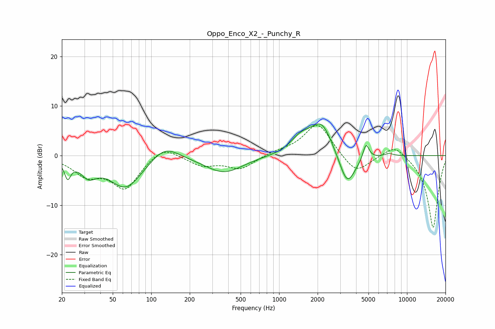

# Oppo_Enco_X2_-_Punchy_R
See [usage instructions](https://github.com/jaakkopasanen/AutoEq#usage) for more options and info.

### Parametric EQs
Apply preamp of -6.5 dB when using parametric equalizer.

|   # | Type    |   Fc (Hz) |    Q |   Gain (dB) |
|-----|---------|-----------|------|-------------|
|   1 | Peaking |        22 | 5.87 |        -3.4 |
|   2 | Peaking |        32 | 2.32 |        -3   |
|   3 | Peaking |        63 | 1.1  |        -6.5 |
|   4 | Peaking |       128 | 1.32 |         3.1 |
|   5 | Peaking |       371 | 0.96 |        -3.4 |
|   6 | Peaking |      1477 | 1.78 |         2.8 |
|   7 | Peaking |      2149 | 1.6  |         6.6 |
|   8 | Peaking |      3408 | 2.16 |        -6.9 |
|   9 | Peaking |      4780 | 5.97 |         3.3 |
|  10 | Peaking |      7231 | 3.85 |         0.5 |

### Fixed Band EQs
When using fixed band (also called graphic) equalizer, apply preamp of **-6.2 dB** (if available) and set gains manually with these parameters.

|   # | Type    |   Fc (Hz) |    Q |   Gain (dB) |
|-----|---------|-----------|------|-------------|
|   1 | Peaking |        31 | 1.41 |        -3.5 |
|   2 | Peaking |        62 | 1.41 |        -6.4 |
|   3 | Peaking |       125 | 1.41 |         2.4 |
|   4 | Peaking |       250 | 1.41 |        -1.9 |
|   5 | Peaking |       500 | 1.41 |        -2.6 |
|   6 | Peaking |      1000 | 1.41 |         0.7 |
|   7 | Peaking |      2000 | 1.41 |         6.7 |
|   8 | Peaking |      4000 | 1.41 |        -3.9 |
|   9 | Peaking |      8000 | 1.41 |         2.6 |
|  10 | Peaking |     16000 | 1.41 |       -14.7 |

### Graphs

