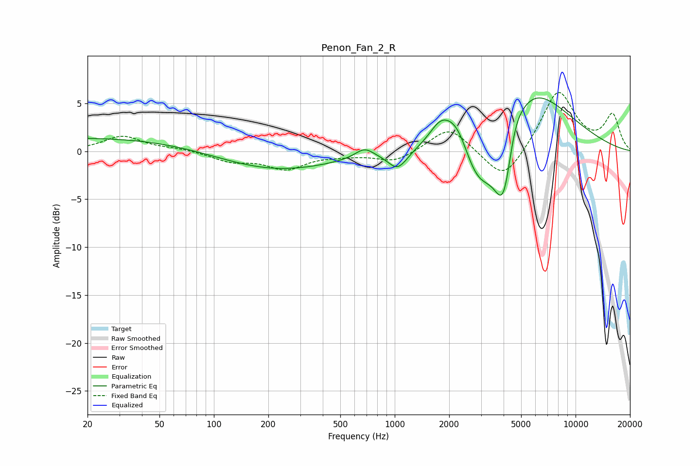

# Penon_Fan_2_R
See [usage instructions](https://github.com/jaakkopasanen/AutoEq#usage) for more options and info.

### Parametric EQs
Apply preamp of -5.7 dB when using parametric equalizer.

|   # | Type    |   Fc (Hz) |    Q |   Gain (dB) |
|-----|---------|-----------|------|-------------|
|   1 | Peaking |        26 | 0.19 |         1.5 |
|   2 | Peaking |       207 | 0.42 |        -2.2 |
|   3 | Peaking |       680 | 2.77 |         1   |
|   4 | Peaking |      1038 | 2.58 |        -2   |
|   5 | Peaking |      1789 | 2.22 |         2.3 |
|   6 | Peaking |      2229 | 1.86 |         4.1 |
|   7 | Peaking |      2863 | 1.19 |        -7.9 |
|   8 | Peaking |      4019 | 2.38 |        -9.7 |
|   9 | Peaking |      4543 | 3.08 |         2.3 |
|  10 | Peaking |      5020 | 0.62 |         8.9 |

### Fixed Band EQs
When using fixed band (also called graphic) equalizer, apply preamp of **-6.2 dB** (if available) and set gains manually with these parameters.

|   # | Type    |   Fc (Hz) |    Q |   Gain (dB) |
|-----|---------|-----------|------|-------------|
|   1 | Peaking |        31 | 1.41 |         1.6 |
|   2 | Peaking |        62 | 1.41 |         0.2 |
|   3 | Peaking |       125 | 1.41 |        -1   |
|   4 | Peaking |       250 | 1.41 |        -1.7 |
|   5 | Peaking |       500 | 1.41 |        -0.3 |
|   6 | Peaking |      1000 | 1.41 |        -1.1 |
|   7 | Peaking |      2000 | 1.41 |         2.6 |
|   8 | Peaking |      4000 | 1.41 |        -3.4 |
|   9 | Peaking |      8000 | 1.41 |         6.4 |
|  10 | Peaking |     16000 | 1.41 |         3.7 |

### Graphs

