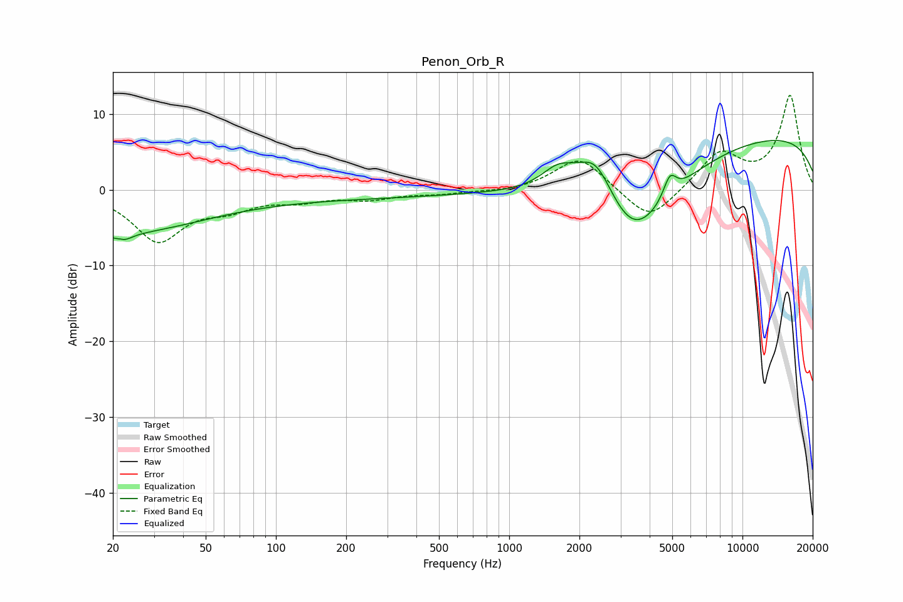

# Penon_Orb_R
See [usage instructions](https://github.com/jaakkopasanen/AutoEq#usage) for more options and info.

### Parametric EQs
Apply preamp of -6.6 dB when using parametric equalizer.

|   # | Type    |   Fc (Hz) |    Q |   Gain (dB) |
|-----|---------|-----------|------|-------------|
|   1 | Peaking |        21 | 5.57 |         2.1 |
|   2 | Peaking |        21 | 4.21 |        -3.2 |
|   3 | Peaking |        23 | 0.45 |        -5.1 |
|   4 | Peaking |       152 | 0.24 |        -1.1 |
|   5 | Peaking |      1628 | 1.84 |         3.1 |
|   6 | Peaking |      2348 | 1.68 |         6.6 |
|   7 | Peaking |      3401 | 0.78 |       -12.5 |
|   8 | Peaking |      4885 | 5.07 |         2.9 |
|   9 | Peaking |      9676 | 0.18 |         4.1 |
|  10 | Peaking |      9885 | 0.18 |         3.5 |

### Fixed Band EQs
When using fixed band (also called graphic) equalizer, apply preamp of **-12.6 dB** (if available) and set gains manually with these parameters.

|   # | Type    |   Fc (Hz) |    Q |   Gain (dB) |
|-----|---------|-----------|------|-------------|
|   1 | Peaking |        31 | 1.41 |        -6.6 |
|   2 | Peaking |        62 | 1.41 |        -2   |
|   3 | Peaking |       125 | 1.41 |        -1.2 |
|   4 | Peaking |       250 | 1.41 |        -1.1 |
|   5 | Peaking |       500 | 1.41 |        -0.5 |
|   6 | Peaking |      1000 | 1.41 |        -0.3 |
|   7 | Peaking |      2000 | 1.41 |         4.4 |
|   8 | Peaking |      4000 | 1.41 |        -4.5 |
|   9 | Peaking |      8000 | 1.41 |         4.8 |
|  10 | Peaking |     16000 | 1.41 |        12.3 |

### Graphs

