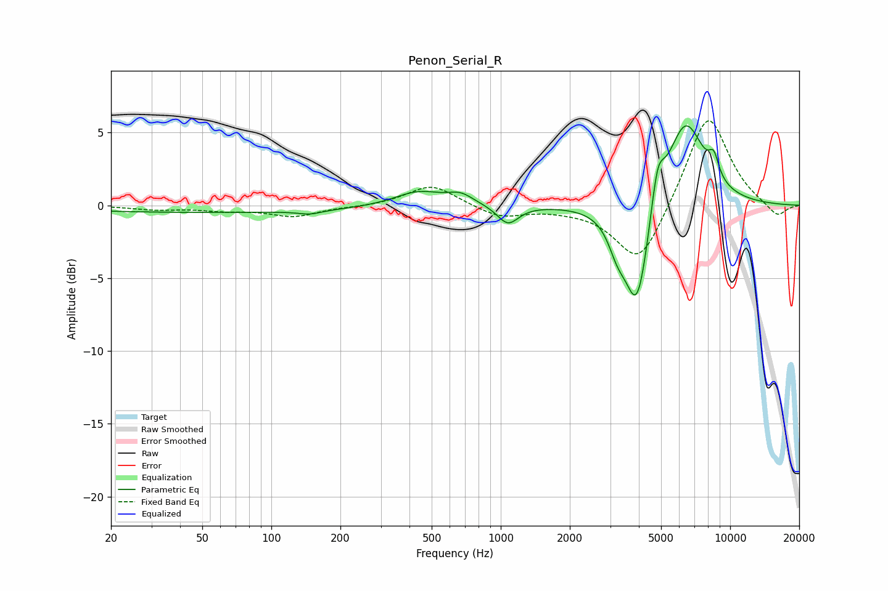

# Penon_Serial_R
See [usage instructions](https://github.com/jaakkopasanen/AutoEq#usage) for more options and info.

### Parametric EQs
Apply preamp of -5.6 dB when using parametric equalizer.

|   # | Type    |   Fc (Hz) |    Q |   Gain (dB) |
|-----|---------|-----------|------|-------------|
|   1 | Peaking |        56 | 0.19 |        -0.5 |
|   2 | Peaking |       147 | 2.75 |        -0.3 |
|   3 | Peaking |       438 | 1.32 |         1   |
|   4 | Peaking |       669 | 2.56 |         0.6 |
|   5 | Peaking |      1075 | 3.05 |        -1.3 |
|   6 | Peaking |      3223 | 3.58 |        -1.7 |
|   7 | Peaking |      3933 | 2.58 |        -7.5 |
|   8 | Peaking |      4825 | 4.82 |         2.9 |
|   9 | Peaking |      6372 | 1.64 |         6   |
|  10 | Peaking |      8485 | 5.79 |         1.4 |

### Fixed Band EQs
When using fixed band (also called graphic) equalizer, apply preamp of **-5.9 dB** (if available) and set gains manually with these parameters.

|   # | Type    |   Fc (Hz) |    Q |   Gain (dB) |
|-----|---------|-----------|------|-------------|
|   1 | Peaking |        31 | 1.41 |        -0.3 |
|   2 | Peaking |        62 | 1.41 |        -0.3 |
|   3 | Peaking |       125 | 1.41 |        -0.7 |
|   4 | Peaking |       250 | 1.41 |        -0.1 |
|   5 | Peaking |       500 | 1.41 |         1.5 |
|   6 | Peaking |      1000 | 1.41 |        -0.8 |
|   7 | Peaking |      2000 | 1.41 |        -0.2 |
|   8 | Peaking |      4000 | 1.41 |        -4.2 |
|   9 | Peaking |      8000 | 1.41 |         6.5 |
|  10 | Peaking |     16000 | 1.41 |        -0.9 |

### Graphs

