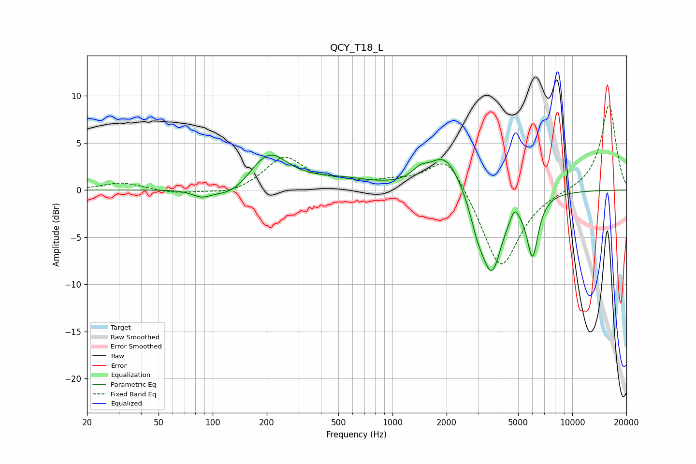

# QCY_T18_L
See [usage instructions](https://github.com/jaakkopasanen/AutoEq#usage) for more options and info.

### Parametric EQs
Apply preamp of -3.8 dB when using parametric equalizer.

|   # | Type    |   Fc (Hz) |    Q |   Gain (dB) |
|-----|---------|-----------|------|-------------|
|   1 | Peaking |        87 | 2.84 |        -0.7 |
|   2 | Peaking |       128 | 1.43 |        -1.4 |
|   3 | Peaking |       205 | 1.31 |         3.9 |
|   4 | Peaking |       505 | 0.81 |         1   |
|   5 | Peaking |      1420 | 3.39 |         0.9 |
|   6 | Peaking |      1965 | 1.52 |         4   |
|   7 | Peaking |      2970 | 3.39 |        -2.3 |
|   8 | Peaking |      3566 | 2.34 |        -8.4 |
|   9 | Peaking |      4772 | 6    |         1.3 |
|  10 | Peaking |      6014 | 4.36 |        -6.2 |

### Fixed Band EQs
When using fixed band (also called graphic) equalizer, apply preamp of **-9.1 dB** (if available) and set gains manually with these parameters.

|   # | Type    |   Fc (Hz) |    Q |   Gain (dB) |
|-----|---------|-----------|------|-------------|
|   1 | Peaking |        31 | 1.41 |         0.8 |
|   2 | Peaking |        62 | 1.41 |        -0.4 |
|   3 | Peaking |       125 | 1.41 |        -0.6 |
|   4 | Peaking |       250 | 1.41 |         3.4 |
|   5 | Peaking |       500 | 1.41 |         0.6 |
|   6 | Peaking |      1000 | 1.41 |         0.7 |
|   7 | Peaking |      2000 | 1.41 |         4.1 |
|   8 | Peaking |      4000 | 1.41 |        -8.7 |
|   9 | Peaking |      8000 | 1.41 |        -0.1 |
|  10 | Peaking |     16000 | 1.41 |         9.1 |

### Graphs

