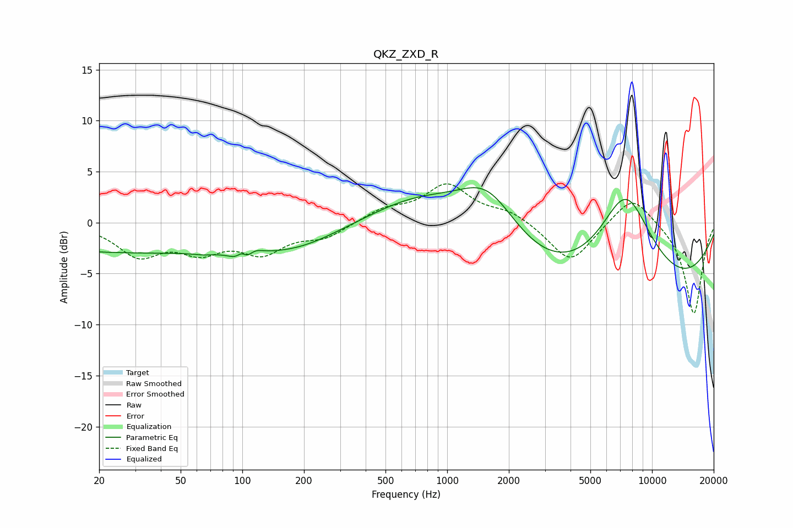

# QKZ_ZXD_R
See [usage instructions](https://github.com/jaakkopasanen/AutoEq#usage) for more options and info.

### Parametric EQs
Apply preamp of -3.5 dB when using parametric equalizer.

|   # | Type    |   Fc (Hz) |    Q |   Gain (dB) |
|-----|---------|-----------|------|-------------|
|   1 | Peaking |        29 | 0.18 |        -2.9 |
|   2 | Peaking |        64 | 3.03 |        -0.2 |
|   3 | Peaking |        99 | 5.51 |         2.2 |
|   4 | Peaking |       100 | 3.91 |        -2.7 |
|   5 | Peaking |       114 | 3.88 |         0.6 |
|   6 | Peaking |       189 | 0.7  |        -1.5 |
|   7 | Peaking |       737 | 0.61 |         2.8 |
|   8 | Peaking |      1577 | 0.91 |         5.9 |
|   9 | Peaking |      6847 | 0.2  |        -8.5 |
|  10 | Peaking |      7436 | 0.93 |        10.4 |

### Fixed Band EQs
When using fixed band (also called graphic) equalizer, apply preamp of **-3.9 dB** (if available) and set gains manually with these parameters.

|   # | Type    |   Fc (Hz) |    Q |   Gain (dB) |
|-----|---------|-----------|------|-------------|
|   1 | Peaking |        31 | 1.41 |        -3   |
|   2 | Peaking |        62 | 1.41 |        -2.4 |
|   3 | Peaking |       125 | 1.41 |        -2.6 |
|   4 | Peaking |       250 | 1.41 |        -1.3 |
|   5 | Peaking |       500 | 1.41 |         1.2 |
|   6 | Peaking |      1000 | 1.41 |         3.6 |
|   7 | Peaking |      2000 | 1.41 |         1   |
|   8 | Peaking |      4000 | 1.41 |        -4   |
|   9 | Peaking |      8000 | 1.41 |         2.9 |
|  10 | Peaking |     16000 | 1.41 |        -9   |

### Graphs

